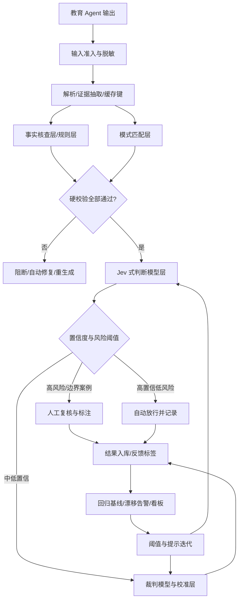

# 教育 Agent 质量与稳定性评测体系优化方案

## 摘要

Jev 真正可迁移的不是“让一个模型替所有评委拍板”，而是三个工程原则：把开放问题拆成可判定、可复用的原子判断题；把结构化输出边界前移，避免让生成模型承担不必要的格式解析；让概率驱动分流而不是替代事实判断。其官方架构让所有问题对同一状态并行独立评估，状态只读一次，增加问题对延迟影响有限，但每个问题必须是“一个具体判断”，复杂判断要在代码里组合；版本文档更明确列出字面理解、算术、计数、日期、多跳间接推理等九类弱点[1][2][3]。因此，重构后的体系应采用“规则与代码最先、模式匹配其次、Jev 式快判断居中、裁判大模型托底、人工校准收口”的五层结构，而不是把 Jev 当作全能质量判官。

对教育业务而言，题目与解析、知识讲解、学习规划、批改与反馈应共用一套评测总线，但质量字典和分流策略分别设计。答案对不对、公式与单位、引用是否真实、适龄口径、评分档位、计划可执行项等项，先转成规则、解析器、确定性计算或二元判断题；只有“讲得好不好、启发是否充分、批改宽严是否合适”等必须结合教育上下文的价值判断才进入裁判模型。报告给出的指标口径包括：多次采样一致率、同题异表述一致率、同分口径复现率、回归基线差额、可靠性曲线、ECE/MCE、Cohen’s κ 与加权 κ、Spearman 和 Kendall 一致性。最后给出 6 周落地路线图、提示模板复用、批量与降级策略，以及可直接填写的评测报告与告警模板。需要特别说明：截至 2026 年 9 月 21 日，Jev 发布仅约一周，公开社区测试样本小、任务差异大，官方报告中的速度、成本和准确率不可直接视为统一基准；本文用其原理作架构迁移依据，阈值和性价比必须由公司内部标注集重新估计。

## 一、Jev 的核心不是“不幻觉”，而是把判断变成可组合、可分流的软件接口

**Jev 的价值来自边界收缩：它只回答开发者预先定义好的问题，不生成自由文本。** 官方把 Jev 定义为 System One model，输入是一块“state”和一组类型化问题，输出是 Choice、Score、Noul 三类结果及概率。Choice 从固定选项集中选一个；Score 把对象放到有序等级上；Noul 判断命题为真的概率。其关键不是模型“知道得更多”，而是输出空间被压缩成程序可直接消费的值。所有问题对同一状态并行、隔离地评估，增加问题数不会让上下文反复退化，延迟增长也远低于串行生成解释；官方因此建议把复杂问题拆成若干原子问题，再由代码组合结果[1]。这一设计把质量评测从“让模型写评语”变成“让模型给一组可验证的槽位填值”，值得整体借鉴。

**“一次 prefill、多题并行”的可迁移内核是共享证据、独立判断题、批量返回。** 在教育评测中，同一份输出往往需要检查答案正确性、适龄性、结构完整性和安全风险。传统做法是反复把原文塞给裁判模型，每次生成不同提示，既重复付费，也引入不一致。可迁移的做法是：先解析输出、抽取题目、答案、步骤、引用、评分点，再围绕同一份结构化证据块并行提问。比如“解题步骤是否存在逻辑断点”“是否虚构引用”“是否使用超纲概念”可以分别提问，最后由代码组合成风险等级。官方官方文档明确指出，多个问题可混合在一个请求中，但“原子问题、代码组合”是其推荐模式[1]；这与现代评测工程追求的可追溯、可缓存、可降级是一致的。

**Jev 的三类题型对应三种评测决策，不能只根据熟悉程度选型。** Noul 适合二元命题：“这段文字是否包含未经引用的外部事实”“答案与标准答案是否等价”“是否出现年级超纲术语”。Choice 适合互斥分类：“缺失环节位于步骤 1/步骤 2/步骤 3/无断点”“风险等级为低/中/高/需人工”。Score 适合有清晰锚点的序数判断：“知识讲解的适龄性落在哪一级”“作文内容维度是否符合评分规则的第几档”。官方把 Choice 定义为“从选项中选一个”，Score 定义为“在有序 rubric 上定位”，Noul 定义为“这个命题是否为真”，三者返回不同形状的结果[2]。设计时应优先 Noul 和窄 Choice；只有当“相差一档”与“相差三档”的损失确实不同时，才使用加权处理的序数评分。

**“输出即 schema”消除了格式错误，却没有消除事实错误。** 官方文档称其不生成文本、不需要解析，程序可以直接分支；概率分布和置信度也可由代码消费[1]。这是“类型层面零幻觉”：不可能返回一个非法 JSON、凭空发明 D 选项或输出乱码。但它不是“语义层面零幻觉”：一个选项框内的错误选项仍可能被选中，一个格式正确的分数仍可能违背教育评分规则。对教育产品尤其危险，因为“判定无异常”与“教学内容正确”是两件事。应把 schema 通过视为必要检查，而不是放行条件。

**“单次 prefill”主要是并行和缓存单元，不是天然的跨题逻辑保证。** 官方强调问题相互独立，因此一个题的结果不会自动引用另一个题的结论。若先判“是否包含引用”，再根据结果判“引用是否真实”，应拆成两轮：第一轮确定候选引用，代码抽取证据后第二轮核验；或者把两题顺序固定为两次调用。代码还要负责去重、聚合、阈值、冲突消解、审计与降级。换言之，Jev 提供的是可并行的判断题集合，不是工作流引擎。

**可靠性来自概率可用，而不是概率等于事实。** 官方说明 Choice 和 Score 输出每个候选或等级的概率分布，置信度由分布形状推导；置信度不是独立、天然正确的事实概率[4]。它适合在批量任务中把样本分成“自动处理、抽样复检、升级裁判、转人工”的桶。阈值应按后果分档，而不是用固定 0.9 全局放行[4]。例如“学生答案完全正确”的错误放行成本低于“给出错误学习路径却直接放行”，两者不应共用一个置信门槛。

## 二、哪些思想必须迁移，哪些场景必须保留确定性或人工判断

**可迁移一：先定义决策边界，再选择模型。** 每项质量检查都应先问：输出空间是否已知？是否可判定真值？是否要求解释？若答案固定、证据完整，优先规则或代码；若只是语义分类，可考虑 Jev 式判断题；若需要综合解释，才让裁判大模型生成理由。不要把“请评价这份讲解质量”这种混合问题直接交给快判断模型，也不要让裁判模型每天重复解析“分数是否为数字”。

**可迁移二：把宽题拆窄，把聚合留在代码。** 官方建议每个问题问一件具体、范围明确的事，复杂问题分解为多个因素，再组合权重[1]。例如不要问“这份作业批改是否好”，而应拆为“评分档位是否与评分点对应”“扣分理由是否指向具体位置”“评语是否给出可操作建议”“是否存在明显观点偏差”。代码可将这些结果加权或按风险取最大等级，但权重是产品参数，不应藏在提示词里。

**可迁移三：概率驱动路由，不是概率替代人工。** 对每道快判断题记录原始概率、置信度、模型版本、提示版本和证据摘要。系统只在高概率区间自动放行；中低概率区间按风险升级。官方文档也强调阈值随风险变化，而不是一个统一数字[4]。这比“模型给分后直接显示”更符合教育业务：高质量覆盖与低错误放行可以同时优化。

**可迁移四：版本和提示共同构成校准模型。** 概率与阈值依赖模型版本、提示措辞、state 构成和标注分布。应把 `judge_model_id`、`judge_prompt_version`、`rubric_version`、`student_grade`、`subject`、`output_type` 作为分层校准键。Jev 的并行与概率输出尤其适合做这种可观测分流，但不能把同一阈值跨题、跨语言或跨学段搬用。

**不可照搬一：数学、计数、单位换算不能交给 Jev 直接判断。** 官方把数学、数字、日期比较明确列为已知弱点，要求把算术留在代码；计数不可靠，应先让代码正则或解析候选，再逐候选判断语义，最后在代码中求和[3]。因此“3 步能否解出”“方程两边是否等价”“年龄是否满 12 岁”“段落中是否有 3 个事实错误”都不是好的直接判断题。代码应先做表达式解析、数量统计、单位转换和日期比较；模型只判断语义层面的“步骤解释是否充分”。

**不可照搬二：事实核查与引用验证不能由答案生成模型自我背书。** Jev 本身不联网，也不具备独立于 state 的知识；它只能根据提供的材料判断。因此“引用是否真实”必须转换为可执行的检索或证据链：从输出抽取主张与参考文献，检索权威教材、课程标准、题库或内部知识库，再进行命题级 entailment。没有候选证据时，应判为“无法验证”，而不是判为“正确”。对低龄内容、心理健康、考试评分、升学建议，误判代价更高，应设置比普通语言润色更严格的升级门槛。

**不可照搬三：开放教育价值不能压缩成一个总分。** “讲解是否启发思考”“学习路径是否可执行”“作文评语是否兼顾鼓励与纠偏”涉及多目标权衡。Score 可以测量单一有序维度，但若把所有维度塞进“1—10 分”会丢失诊断信息。应先用多道窄题覆盖具体维度，裁判模型仅处理冲突、边界和综合判断，并把“为什么这样判断”作为可审计理由。

**不可照搬四：自报概率不能被当作真实正确率。** 官方强调校准是对预测概率群体属性的训练目标，并不保证单个预测绝对正确[4]。早期公开社区测试样本小且任务异质，有人报告高置信样本与真实正确率基本吻合，也有人报告 Choice 过度自信、Score 校准较差。Arize 汇总了 777 项判断低于 0.7 秒、约四分之一美分等案例，同时明确指出官方性能数字来自厂商工作流评测，并非独立基准[5]。这些数据适合说明潜力，不适合直接成为生产阈值。本文图 2 的合成校准曲线也仅用于演示方法。

*图 1：越接近开放教育判断，成本与歧义越高；越结构化，越应先走确定性校验。数据来源：依据 TypeSafe Jev 官方分层原则与本报告迁移设计（示意排序，非统一基准）[1][4]。*

[下载分层迁移数据](/data/workspace/dr:7764f641/data_分层迁移.csv)

## 三、五层分层架构：把确定性校验放在快判断前面，把裁判模型放在争议后面

**重构目标不是“所有质量 Agent 统一成一个模型”，而是用统一总线协调五种能力。** 推荐架构如下：

**第一层是事实核查层/规则层，也是质量与安全的硬底线。** 它不调用生成模型，执行 JSON schema、必填字段、题型、年级、答案存在性、选项数量、步骤编号、引用 URL、公式 LaTeX、单位、关键词黑名单、敏感内容规则、内部知识库版本等校验。规则引擎还负责年龄与难度映射、课程标准版本、时间窗口、计算量检查、题目—解析—答案三元一致性。结果只有三类：`pass`、`fail`、`needs_evidence`，避免用概率模糊硬错误。

**第二层是模式匹配层，负责把自由文本变成可判断题。** 它做题目与标准答案归一化、数学表达式等价化简、实体抽取、证据定位、评分点覆盖率、引用定位、拼写与语法检查、图像或表格描述抽取。可以调用轻量解析器、检索器或小规模编码器。此层适合批量和缓存：同一原文、同一提取配置应直接命中缓存；仅当上游模型或提取规则变化时失效。

**第三层是 Jev 式判断模型层，只处理可判定、可复用的语义判断题。** 它接收清洗后的 state、证据和窄问题，一次性并行返回 Choice/Score/Noul 及概率。它不负责生成总评、解释原因或编写改进建议。适合项包括：知识点陈述是否准确、步骤是否出现逻辑断点、适龄术语是否超纲、是否出现幻觉风险、批改理由是否与扣分点对应、规划前提是否与学情一致。计数和算术仍由第二层代码完成。

**第四层是裁判模型与校准层，只处理争议与开放判断。** 输入应包含固定上下文：学生年级、课程版本、题目、标准答案或评分规则、学生输出、证据、已知硬校验结果、待裁决问题。裁判输出采用严格 schema，至少包含 `decision`、`confidence`、`dimension`、`evidence_span`、`reasoning`、`needs_human_review`。它不重复做第一层能做好的格式检查，也不重写业务对象。同一题并行多个角度比让一个裁判写大段“总评”更可控。

**第五层是人工与闭环层，生产教育价值而非拖慢系统。** 教师、学科教研员、评分专家按“高风险优先、低置信优先、争议样本优先”抽样。人工结果必须记录 `gold_label`、`severity`、`category`、`review_effort`、`disagreement_type`，并回流成新基准。人工只复核必要质量项，不把快判断题升级后让裁判重新生成整篇文本。

**每一层都应输出统一质量事件。** 建议事件至少包含：`run_id`、`tenant_id`、`product_type`、`agent_version`、`prompt_version`、`judge_model_id`、`judge_prompt_version`、`rubric_version`、`output_hash`、`input_hash`、`quality_dimension`、`layer`、`decision`、`confidence`、`threshold_version`、`human_label`、`cost_usd`、`latency_ms`、`evidence_refs`、`policy_action`。这是稳定性监控和校准复现的前提。

## 四、四类教育输出的质量字典：把“好”转成可判定项

### 4.1 题目与解析：正确性优先于文采

**答案正确不是唯一目标，题目、解题步骤、答案和判定口径必须内部闭环。** 核心维度包括：答案正确性、答案唯一性与多解完整性、题型与难度匹配、解题步骤完整性、步骤间逻辑断点、最终结果与中间步骤一致性、公式与单位、题干歧义、超纲内容、敏感或不当情境、判定理由可追溯。硬校验应包括答案存在、LaTeX 可解析、单位数量级、选项互斥、最终答案出现在指定位置；快判检查步骤是否跳跃、条件是否被错误引入；裁判只在复杂证明、多解合理性、题目情境教育适宜性等边界情形介入。

| 质量维度 | 硬校验 | Jev 式快判 | 裁判大模型 |
|---|---|---|---|
| 答案正确性 | 答案存在、表达式可解析、单位存在 | “候选答案与标准答案是否等价” | 多解、近似答案、反例与开放证明 |
| 解题步骤逻辑 | 步骤编号连续、最终答案与中间式一致 | 某步是否有前提/运算/解释断点 | 证明策略是否合理、多路径选择 |
| 知识性错误 | 关键公式可解析 | 命题与给定定理是否冲突 | 跨学科隐含前提的教育解释 |
| 公式与单位 | 单位换算、量纲、符号范围规则 | 单位是否按口径使用 | 非标准符号的教育解释是否充分 |
| 题目唯一性 | 选项数、答案键、约束条件完整 | 条件是否足以确定唯一解 | 情境歧义是否影响教育目标 |
| 适龄与难度 | 年级、课标标签、禁止词命中 | 术语是否超出目标学段 | 题目挑战与学习价值权衡 |
| 安全合规 | 敏感词、个人可识别信息、禁止情境 | 是否隐含偏见或不当压力 | 教育公平与价值引导判断 |

### 4.2 知识讲解：先查事实，再判教学价值

**“讲得对”是底线，“讲得懂、讲得合适”才是分层评测的意义。** 维度包括：事实正确性、引用与权威依据、概念边界、因果链、解释顺序、术语适龄、抽象层级、举例贴切、启发性、结构完整性、语气与价值导向、幻觉风险。代码先检查术语定义一致性、关键数字、标准版本和引用可达性；快判做“是否混淆相关概念”“是否使用未定义术语”“关键证据是否出现”等窄题；裁判才评估类比是否贴切、启发提问是否有效。

| 质量维度 | 硬校验 | Jev 式快判 | 裁判大模型 |
|---|---|---|---|
| 知识性错误 | 权威术语、事实主张、版本规则 | 某句与给定证据是否冲突 | 跨学科边界与上下文适用条件 |
| 幻觉引用 | URL/DOI 格式、引用存在、位置对应 | 引用是否支持该主张 | 间接引用、权威性权衡 |
| 概念边界 | 术语库、定义槽位、公式范围 | “是否混淆 A 与 B 的关键差异” | 概念层级与认知负荷安排 |
| 适龄性 | 课标、年级、词表、禁止超纲项 | 某术语是否超出目标学段 | 抽象程度与脚手架设计 |
| 讲解结构 | 标题、定义、例证、小结齐全 | 是否存在未完成结构 | 逻辑递进与重复冗余 |
| 启发性 | 固定问题、示例模板命中 | 是否包含开放追问 | 苏格拉底式引导质量 |
| 观点偏差 | 规则词库、敏感实体清单 | 是否把争议事实表述为确定 | 价值引导与教育公平判断 |

### 4.3 学习规划：可执行性比“看起来合理”更重要

**学习规划的失败往往不是文字不流畅，而是前提冲突、动作不可执行、资源不可达。** 维度包括：学情输入与输出前提一致性、目标可测性、任务粒度、时间可行、资源存在、先修依赖、难度递进、多样性、可追踪里程碑、风险与备份方案、年级与课标适配。硬校验先检查日期、时长、资源链接、重复任务和先修依赖图；快判判断“规划是否预设了不存在的能力”“是否忽略了截止日期”；裁判判断路径选择、动机适配、长期可持续性。

| 质量维度 | 硬校验 | Jev 式快判 | 裁判大模型 |
|---|---|---|---|
| 前提一致性 | 学段、目标、当前能力、截止日存在 | 建议是否预设未知能力 | 学情推断是否合理 |
| 时间可行性 | 总时长、日时长、任务数与截止日 | 单日任务是否超负荷 | 节奏与坚持概率权衡 |
| 资源可执行 | 链接可达、资源标签、权限检查 | 资源是否匹配当前目标 | 资源质量与替代方案 |
| 先修依赖 | 依赖图无环、顺序规则 | 是否跳过必要前置 | 依赖粒度与学习迁移 |
| 目标可测 | SMART 字段、里程碑存在 | 目标是否可观察/可验证 | 目标难度与学生动机匹配 |
| 风险与弹性 | 重计划触发条件存在 | 是否忽略已知阻塞项 | 应急路径的教育适配 |
| 适龄与难度 | 课标、年级、时长边界 | 任务是否明显超/低龄 | 最近发展区判断 |

### 4.4 批改与反馈：同分口径可复现比“总分像人”更重要

**作文和作业批改要同时评“分对不对”与“反馈能否改进学习”。** 维度包括：评分规则覆盖、档位证据、扣分点定位、评分可复现性、反馈具体性、鼓励与纠偏平衡、观点偏差、引用范文或规则的一致性、敏感评语、学生可行动建议、隐私。硬校验包括总分等于分项、档位映射、规则版本、引用原文位置；快判可检查“该扣分点是否有原文证据”“评语是否与评分一致”；裁判判断宽严、鼓励与纠正平衡、开放性表达是否误伤。

| 质量维度 | 硬校验 | Jev 式快判 | 裁判大模型 |
|---|---|---|---|
| 评分口径 | 总分、分项、权重、规则版本一致 | 证据是否落入所选档位 | 边界样本宽严与跨维度平衡 |
| 扣分证据 | 位置可定位、引用存在 | 评语是否指向具体文本 | 错误类型与反馈匹配 |
| 可复现性 | 多次重评、同分口径复现 | 两次是否落在同一档 | 分歧解释与规则澄清 |
| 反馈质量 | 必答槽位、行动动词存在 | 是否给出可执行建议 | 鼓励、纠偏与教学价值 |
| 观点偏差 | 规则词表、立场敏感项 | 是否将争议判断当事实 | 价值引导、文化与公平 |
| 隐私安全 | 学生个人信息、评语越界检测 | 是否存在不当披露 | 高风险心理健康与升学措辞 |

## 五、统一的三级分流：确定性、快判断、裁判形成一条可计费决策链

**每项质量项必须有唯一的主路由，不能让各层重复判断。** 建议默认顺序为：硬校验 → 模式匹配 → 快判断 → 裁判 → 人工；但在生产低延迟路径中，可先并行触发快判断与缓存命中，硬失败仍优先覆盖。主路由写入 `quality_dimension` 的规则配置，配置包括问题类型、state 模板、证据字段、阈值版本、模型、超时、缓存键、降级策略与责任人。

| 类型 | 硬校验/规则 | Jev 式快判 | 裁判大模型 | 人工复核 |
|---|---|---|---|---|
| 题目与解析 | 答案键、公式、单位、步骤结构 | 步骤断点、知识冲突、超纲术语 | 多解、证明、开放题 | 高风险/教研争议 |
| 知识讲解 | schema、引用格式、版本、词表 | 概念混淆、幻觉主张、未定义术语 | 启发性、递进、教育适宜性 | 敏感或权威结论 |
| 学习规划 | 日期、时长、依赖图、资源可达 | 前提冲突、超负荷、依赖遗漏 | 动机适配、节奏、长期可行性 | 升学/健康等高后果 |
| 批改与反馈 | 总分、分项、档位、位置证据 | 扣分证据、反馈一致性 | 宽严、反馈平衡、观点偏差 | 高风险分数与申诉 |

**三级分流不能只看问题难度，还要看损失结构。** 低损失、高频、可结构化项走硬校验和快判；高损失项即使模型高置信也要保留裁判或抽样人工；高频率但风险低的项目可扩大自动覆盖。表内每项可进一步配置三档阈值：自动放行、抽样复检、强制升级。阈值不是模型参数，而是产品策略参数。

**快判断题模板应由固定槽位组装，避免每次重新写提示。** 推荐结构为：`角色与目标` + `固定上下文` + `不可违反规则` + `state引用字段` + `问题` + `选项/等级锚点` + `输出 schema`。对 Jev，官方原语本身就要求问题明确；对生成式裁判，也应要求 JSON 输出。模板的版本、变量哈希、输入截断策略和样例都应进入审计。

**“零幻觉”只发生在类型边界内。** 即使某判断题以 0.99 返回“答案正确”，只要它没有真实参考答案、权威证据或计算证明，就仍是模型估计。系统应把这类结论标记为 `model_judged`，与 `rule_verified`、`evidence_verified` 区分。教育报告中的“已验证”标签不能泛化到全部维度。

## 六、稳定性与一致性：用不同指标回答“输出稳定吗、评分一致吗、是否发生漂移”

**稳定性不是单一指标，而是重复性、等价表述一致、同分口径复现和基线不劣化。** 建议每类输出分别设置稳定性样本池，并按年级、学科、题型、模型版本、提示版本分层。样本要覆盖简单正确、明显错误、边界样本、对抗改写和近期生产样本；不能只抽取“容易判”的普通样本。

### 6.1 多次采样方差与一致率

对同一条输入，固定非随机条件并独立采样 `r` 次，得到 `{y_i}`。

- **硬一致率（完全一致率）**：`ExactConsistency = (1/N) * Σ 1[所有 r 次输出完全相同]`，适合文本、分类标签、结构化对象。
- **字段一致率**：`FieldConsistency = (1/N) * Σ (1/K) * Σ 1[字段 k 在所有 r 次相同]`，可定位是哪个字段抖动。
- **类别一致率（无序）**：`CategoricalConsistency = (1/N) * Σ mode_count(y)/r`，适合类别输出，但需与 κ 配套。
- **序数方差与波动**：`ScoreSD = (1/N) * Σ std(y_i)`；对关键分数还应报告 `P95(|max(y)-min(y)|)`。
- **连续文本稳定距离**：建议只计算结构与关键主张的语义等价率，而不是把所有字符抖动视为质量差；对开放式文本，字符级一致率会低估合理多样性。

**采样次数取决于风险而非固定流行值。** 安全拦截可先固定温度/seed 或最低确定性路径；教育评分建议常规质量门 3 次、高风险 5 次，用多数类/中位数/区间覆盖。若结果用于校准，必须保持与生产相同的采样设置，并记录 seed、temperature、top_p、模型路由。

### 6.2 同题不同表述的一致性

构造语义等价集：改变人称、增加冗余、同义改写、调整选项顺序、改变题目情境，但保持教育答案不变。对第 `j` 组 `m` 个表述：

`ParaphraseConsistency = (1/G) * Σ_j (1 / C(m,2)) * Σ_{a<b} 1[y_a = y_b]`

对有序评分使用等级一致或 Spearman；对复杂文本分别评关键结论、建议动作、风险提示。输出还应包括改写敏感度：`RewriteSensitivity = P(判定随改写变化)`。Jev 官方已明确它会字面理解、范围词与否定会影响判断[3]，因此“同义改写不应改变结果”必须作为上线验收项。

### 6.3 同分口径的复现率

对批改 Agent，同分口径复现率应分别用类别和序数指标：

- **档位一致率**：`BandAgreement = (1/N) * Σ 1[两次档位相同]`。
- **Cohen’s κ**：`κ = (P_o - P_e)/(1 - P_e)`，其中观察一致率 `P_o` 是同意比例，期望一致率 `P_e` 由两位评分者边际频次计算。κ 只适合两名评分者、分类项[6]。
- **加权 κ**：对有序档位，采用线性或二次权重，使“差一档”和“差三档”受到不同惩罚。Cohen 的 κ 不能反映序数差异时，应使用 weighted κ[7]。
- **Spearman ρ**：`ρ = 1 - 6Σd²/[n(n²-1)]`，适合两列序数与连续化评分的顺序相关；d 为同一样本两评分的秩差。
- **Kendall τ**：基于和谐对与不和谐对，适合较小样本、秩次一致性分析；多评分者时采用相应扩展统计量。
- **评分偏差**：`Bias = mean(自动分 - 人工分)`；还需报告各档的条件误差，而非只看总平均。

κ 与相关系数回答不同问题：κ 看校正随机后的类别一致，Spearman/Kendall 看单调排序。作文评分通常同时报告 `BandAgreement`、加权 κ、Spearman ρ；若只报相关系数，可能两个评分系统排序相近却普遍差 1—2 档。

### 6.4 回归基线、漂移和告警

每次模型或提示变更，应在固定基线集上重跑：

- **回归差额**：`Δ = metric_new - metric_baseline`，至少覆盖硬失败率、关键正确率、字段一致率、ECE、裁判覆盖率、人工复核率、P95 延迟和成本。
- **分层回归**：除总指标外，按学科、年级、题型、语言、模型版本分别报告；总平均改善不能掩盖某类题型退化。
- **漂移**：每日观察 judge 输出分布、置信度分布、自动放行率、人工推翻率、硬失败率；用滚动 7 天与上一周期比较。建议告警条件：`|Δ率| > 阈值` 且样本量足够；稀有高后果事件即使绝对数量少也要单独告警。
- **基线冻结**：基线集必须冻结 `input`、`gold_label`、`metric_version`；新增样本进入演进集，不能回溯污染基线。

## 七、校准机制：把自报概率映射成可执行的放行与升级策略

**校准的对象是“真实正确率—自报概率”的关系，而不是对模型口头说“要诚实”。** 对每条有真实标签的判断题，记录模型输出的概率或置信度 `p_i` 和标签 `y_i`（1 为正确）。把 `[0,1]` 分成 `M` 个箱，第 `m` 箱包含 `B_m` 个样本：

- **经验准确率**：`A_m = (1/|B_m|) * Σ_{i∈B_m} y_i`
- **平均置信度**：`C_m = (1/|B_m|) * Σ_{i∈B_m} p_i`
- **ECE**：`ECE = Σ_m (|B_m|/N) * |A_m - C_m|`
- **MCE**：`MCE = max_m |A_m - C_m|`

ECE 是有限样本下的分箱近似，完美校准时各箱落于对角线上[8]。箱子数、等宽或等频、二分类与多选类置信度定义都要固定；小样本时每个箱至少应有足够样本，且需同时看可靠性曲线与 MCE，避免单一 ECE 掩盖尾部过度自信。

*图 2：用真实正确率—自报置信度曲线决定自动放行与人工复核阈值。数据来源：示例合成数据；按 10 个等宽置信区间计算，仅用于演示方法。*

**风险—覆盖率曲线比单个阈值更有决策价值。** 对每个候选阈值 `t`，计算自动处理覆盖率 `coverage(t)` 与对应子集真实准确率 `accuracy(t)`；对每个质量项分别绘制 `accuracy versus coverage`。业务选择应满足：`accuracy(t) ≥ A_min` 且 `coverage(t)` 尽量高；对错误放行代价高的项，`A_min` 取更高。Jev 社区测试中也观察到中等置信样本的经验正确率明显低于其自报概率，因此应以自家曲线为准[5]。

**应按质量项和风险分层校准，而不是合并成一个全局概率。** 建议校准键至少包括：`judge_model_id × judge_prompt_version × quality_dimension × output_type × grade_band × subject × language`。例如“步骤断点”与“内容适龄”即使使用同一判断模型，也不应共享阈值。若样本不足，宁可减少自动放行，也不能用相邻任务的概率冒充本任务概率。

**低置信路由采用四级动作，而不是二分类。** 一级：硬校验失败直接阻断或触发修复；二级：高置信且低风险自动放行；三级：中低置信但结构化问题进入裁判或备选快判断；四级：高风险、规则冲突、学生健康/升学/申诉等场景转人工。对 Noul，可用 `max(p, 1-p)` 表示与“是”的距离；对 Choice/Score，可同时观察获胜概率与分布集中度，但不得把二者简单相乘成“联合正确概率”。

**校准不是一次训练，而是持续监控和再估计。** 每日将抽样标签回流；每周更新高频质量项的校准曲线；模型、提示、课标、年级或数据分布变化时触发重校准。若某一箱的样本少于预设计划（例如少于 30 条），应显示置信区间、扩大标注或降级处理，不以单点经验率设硬阈值。官方没有公开跨业务 ECE 保证，因此生产部署必须自行保留校准集与历史阈值版本。

## 八、简洁高效的评测流水线：批量化、离线化、分级化

**目标不是让每个输出都过一遍完整裁判链，而是让绝大多数样本以最低成本得到足够可靠的判断。** 推荐流水线如下：

1. **批量预生成**：对同一模型版本、提示版本和场景配置，使用冻结输入集预生成输出；保留完整 trace、模型参数、时间戳与版本。
2. **缓存与去重**：以 `input_normalized_hash + agent_version + prompt_version` 为缓存键；对纯规则结果长期缓存，对模型判断按模型版本缓存。输入改写、标准答案或课标变化使缓存失效。
3. **并行硬校验与模式匹配**：所有确定性检查并发执行；只有必要时才抽取候选主张、评分点、引用和公式。
4. **批量快判断**：将同状态多题合并请求；不同状态或异构题按批大小、token 与超时边界分片。Jev 的官方架构支持同一 state 的多个问题并行返回[1]，但批量接口的具体限制须以所用网关文档为准。
5. **抽样裁判**：只对中低置信、硬校验冲突、高风险或新场景抽样。采用“确定性先行、窄快判随后、综合裁判最后”的顺序，不重复提问。
6. **人工复核队列**：按错误严重度、风险、置信度和覆盖缺口排序；教师复核同时产出标注与改进标签。
7. **结果入库与回归看板**：写入质量事件，按分层指标、趋势、漂移、成本、延迟和覆盖率展示。

**并行必须发生在三个边界：输入内多题、输入间批次、流水线不同层。** 同一份解析后的输出可以同时发起硬校验和快判；同模型、同配置的独立样本可批量请求；规则、解析、快判和裁判可根据依赖关系并发。必须串行的是“证据抽取后才能判断”“规则升级后才能确定是否调用裁判”。

**离线层包括基线评测、校准估计、回归测试、抽检看板和阈值模拟。** 生产只做实时必要的硬校验、缓存命中与快判断；裁判和人工可在准实时或离线队列完成。对实时教育交互，可采用“快速放行 + 异步复检”，但涉及高风险动作必须同步完成必要校验。

**成本控制用四把锁。** 第一，提示模板复用和字段最小化：只发送快判真正需要的 state，避免无关上下文；官方也将大块无关细节列为精度下降因素[3]。第二，批量接口与并发限流：将同类检查合并，设置幂等键和超时重试。第三，分级降级：快判断超时回退到规则或缓存上一模型版本，裁判超时回退到人工队列，不能静默返回“通过”。第四，只评估差异：代码、规则或阈值变化时只重跑受影响样本；模型变化才重跑全基线。

**成本指标必须同时报告单位样本成本与风险成本。** 至少包括：`cost_per_output`、`cost_per_quality_dimension`、`judge_call_ratio`、`cache_hit_rate`、`human_review_rate`、`false_pass_cost_estimate`。如果单纯压低裁判调用率，却让更多错误放行，系统并没有变便宜。

## 九、6 周实施路线图：先做可重复基线，再扩快判断和校准

### MVP：第 1—2 周，先把流程变成可追溯数据

**第一周先统一事件模型和四类输出的最小字典。** 交付物包括质量事件 schema、统一 run_id、四类输出样本库、规则配置库、基线集与人工标注规范。验收标准是：每类输出不少于 200 条覆盖样本；每条记录 `agent_version`、`prompt_version`、`output_hash`、`gold_label`；硬校验覆盖 100% 必填结构项。

**第二周先上线规则层与模式匹配层。** 交付物包括公式/单位/引用/日期/步骤解析器、题库与课标配置、批处理框架、缓存、结果库和最小看板。验收标准：基线集硬校验结果与人工复核抽检验证；规则层 P95 延迟、缓存命中率和误拦率达标；所有生产调用可回放。

### 第一阶段：第 3—4 周，建立快判断与裁判分流

**第三周只把 15—25 项高频、可结构化的质量项改成快判断题。** 交付物包括问题模板、state 最小化规则、Jev 或兼容快判断模型的接入适配器、三级路由、失败重试与降级策略。每项必须写明“为什么不用代码”“为什么不需要裁判”。验收标准：同一 state 多题请求稳定可用；关键项自动覆盖提升，且误放率不高于业务底线；任何超时/解析失败不默认通过。

**第四周建立裁判模型和人工闭环。** 交付物包括裁判 prompt、输入上下文包、JSON schema、抽样器、教师复核工作台、争议标签和标注一致性计算。验收标准：裁判输出 schema 解析成功率接近 100%；裁判高置信自动样本与人工金标的关键项 κ 达到团队预定义目标；高风险样本人工覆盖 100%；每条人工修改都能回溯到质量事件。

### 第二阶段：第 5—6 周，从单次准确率升级到稳定性与校准

**第五周完成稳定性、一致性和回归基线。** 交付物包括多次采样器、等价改写集、评分复现集、分层回归集、ECE/κ/Spearman/Kendall 计算器和可靠性曲线。验收标准：每类输出有固定基线；关键项硬一致率、档位复现率和漂移指标上线；基线变更必须双人审批。

**第六周上线分层校准和告警。** 交付物包括每质量项的校准曲线、阈值配置中心、风险—覆盖率模拟器、分级升级策略、成本与质量看板、告警订阅。验收标准：每条自动放行规则都有自家数据支持；高风险项具备独立的低置信升级或人工规则；阈值版本可回滚；完成一次模型/提示变更的回归演练。

**迭代阶段不追求“把所有判断都自动化”。** 第 7 周起按错误损失排序扩大范围：先扩高频、低损失的结构化快判；对人工推翻率高的质量项修订问题或证据；对无法稳定判断的开放项保持裁判或人工。每月做一次阈值复审，每季做一次覆盖率和标注偏差审查。

## 十、可直接使用的评测报告模板

### 10.1 报告头部与实验配置

| 字段 | 填写内容 |
|---|---|
| 报告名称 | 教育 Agent 质量与稳定性回归评测 |
| 评测日期 | YYYY-MM-DD |
| 产品类型 | 题目解析 / 知识讲解 / 学习规划 / 批改反馈 |
| Agent 版本 | `agent_version` |
| 生成 Prompt 版本 | `prompt_version` |
| 裁判模型/快判断模型 | `judge_model_id` |
| Judge Prompt/Rubric 版本 | `judge_prompt_version` / `rubric_version` |
| 基线版本 | 上一生产版本或冻结基线 |
| 样本规模 | 总样本、按学科/年级/题型分层样本 |
| 人工标注人数与协议 | κ 目标、盲评/非盲评、仲裁规则 |
| 实验状态 | 通过 / 条件通过 / 回滚 |

### 10.2 核心指标表

| 指标 | 本期 | 基线 | Δ | 目标 | 状态 |
|---|---:|---:|---:|---:|---|
| 硬校验通过率 |  |  |  |  |  |
| 关键事实正确率 |  |  |  |  |  |
| 答案/评分最终正确率 |  |  |  |  |  |
| 多次采样硬一致率 |  |  |  |  |  |
| 字段一致率（最差字段） |  |  |  |  |  |
| 同题改写一致率 |  |  |  |  |  |
| 档位一致率 |  |  |  |  |  |
| Cohen 加权 κ |  |  |  |  |  |
| Spearman ρ / Kendall τ |  |  |  |  |  |
| 严重错误放行率 |  |  |  |  |  |
| 人工复核推翻率 |  |  |  |  |  |
| 自动放行率 |  |  |  |  |  |
| ECE / MCE |  |  |  |  |  |
| P95 质量判定延迟 |  |  |  |  |  |
| 单输出总成本/快判调用率/缓存命中率 |  |  |  |  |  |

### 10.3 告警规则示例

| 告警级别 | 触发条件 | 自动动作 | 责任人 |
|---|---|---|---|
| P0 | 严重知识性错误放行率较基线上升 ≥ 0.5 个百分点；或高风险违规放行 | 暂停对应模型/提示，回滚，人工复核队列 | 质量负责人 |
| P1 | 关键正确率下降 ≥ 1 个百分点；加权 κ 下降 ≥ 0.05；档位一致率低于目标 | 阻断发布，重跑回归集，进行阈值复审 | 评测负责人 |
| P2 | ECE 上升 ≥ 0.03；中高置信区间真实正确率低于目标；自动放行率异常上升 | 扩大抽样，重估阈值，关闭高后果自动放行 | 校准负责人 |
| P3 | P95 延迟超 SLO；成本环比上升 ≥ 20%；缓存命中率下降 ≥ 10 个百分点 | 降级到规则/缓存版本，限流扩容，优化批大小 | 工程负责人 |
| 数据质量 | 单箱校准样本不足；人工标注 κ 低于 0.70；金标冲突未仲裁 | 停止使用该箱阈值，扩充标注并仲裁 | 教研负责人 |

告警必须附带最小复现样本、质量事件 ID、模型与提示版本、受影响学科/年级/题型。P0/P1 只靠总体指标不足以决策；一旦触发，系统应立即输出分层明细。所有阈值均为模板示例，必须根据公司历史损失、样本量和风险偏好校准。

## 十一、落地判断：用 Jev 的原则重构流程，而不是引入一个新判断模型

**最简洁有效的体系是“确定性校验为底盘、窄判断题为放大层、裁判模型为稀缺资源、人工校准为质量锚点”。** Jev 带来的最大启发是把评测从“再写一个生成 Agent”变成“定义状态、定义问题、定义概率如何分流”。四类教育输出应共用统一事件总线、统一分层路由和统一校准看板，但质量字典、提示模板、阈值和人工规则分别治理。

**是否引入 Jev 本身应由自家对照实验决定。** 用同一批标注数据比较：纯规则、轻量分类器、快判断模型、Jev/兼容 System One 模型、裁判大模型。比较项包括准确率、κ、ECE、覆盖率、P95 延迟、失败率、单位样本成本和人工推翻率。早期社区资料显示 Jev 可能显著降低成本和延迟，但官方数据来自厂商工作流，独立样本小，不能替代公司内部评测[5]。若快判断模型的校准或准确率不优于便宜基线，应继续用规则或小模型，而不是为了“概率化”增加复杂度。

**最终验收不应是“模型更聪明”，而应是四条工程结果。** 第一，每条输出可定位到具体质量项、模型、提示、规则版本和证据；第二，高频可结构化检查不再依赖昂贵的裁判模型；第三，高风险项通过概率与人工双重控制；第四，每次迭代都能证明质量没有退化、成本没有失控。只有这样，Jev 式“原子判断题 + 并行输出 + 概率路由”才真正转化为可生产的教育质量基础设施。

## 引用来源

[1] https://docs.typesafe.ai/introduction
> “Every question is evaluated in parallel and in isolation against the same state in one go. Adding questions barely changes the response time.”

[2] https://docs.typesafe.ai/primitives
> “Choice: Which of these options? Score: Where does this sit on a scale? Noul: Is this true?”

[3] https://docs.typesafe.ai/model-jaggedness/jev-1.13
> “Jev is not a calculator. We strongly recommend implementing any mathematical logic in code. Jev does not count reliably.”

[4] https://docs.typesafe.ai/confidence
> “The shape of that distribution is what tells you how certain the model is: concentrated on one outcome means a confident answer.”

[5] https://arize.com/blog/typesafe-jev-llm-judge
> “The independent data so far is small but it points the same way.”

[6] https://www.cambridge.org/core/services/aop-cambridge-core/content/view/0ADA7BB033C7D65A208D3E2F9A6DA340/S2633776220001533a.pdf/investigating_interrater_reliability_of_qualitative_text_annotations_in_machine_learning_datasets.pdf
> “Cohen's kappa measures the IRR between two raters for categorical items.”

[7] https://www.medcalc.org/en/book/inter-rater-agreement.php
> “For ordinal classifications, weighted kappa assigns partial credit to near-misses according to a weighting scheme.”

[8] https://papers.nips.cc/paper/2020/file/aeb7b30ef1d024a76f21a1d40e30c302-Paper.pdf
> “The ECE can be approximated as a weighted average of the absolute difference between the accuracy and confidence of each bin.”