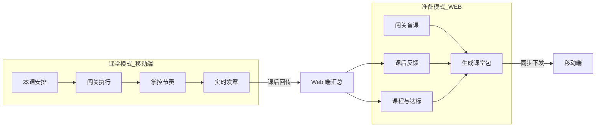
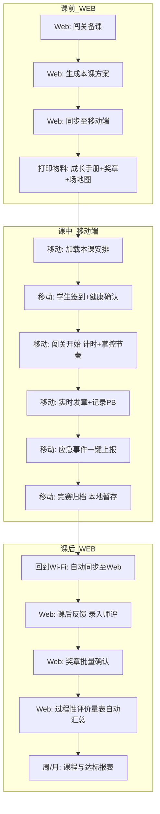
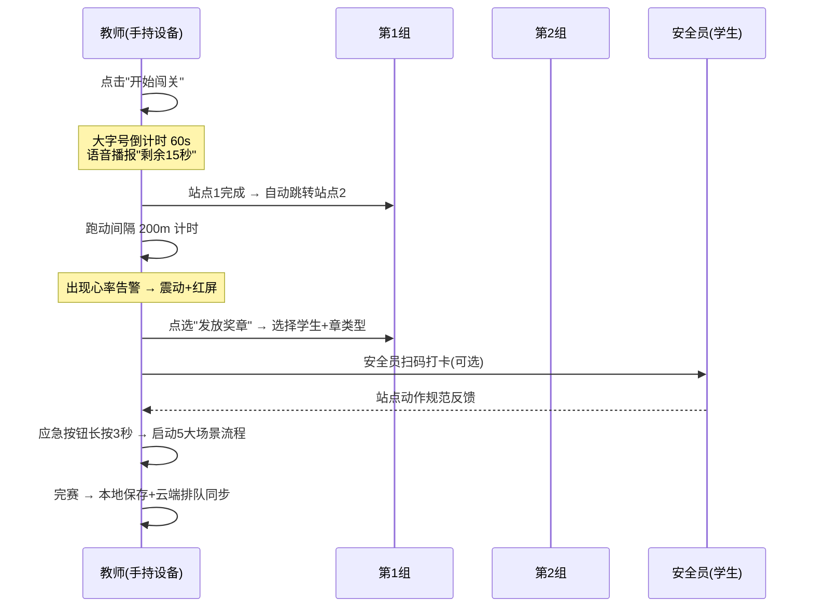
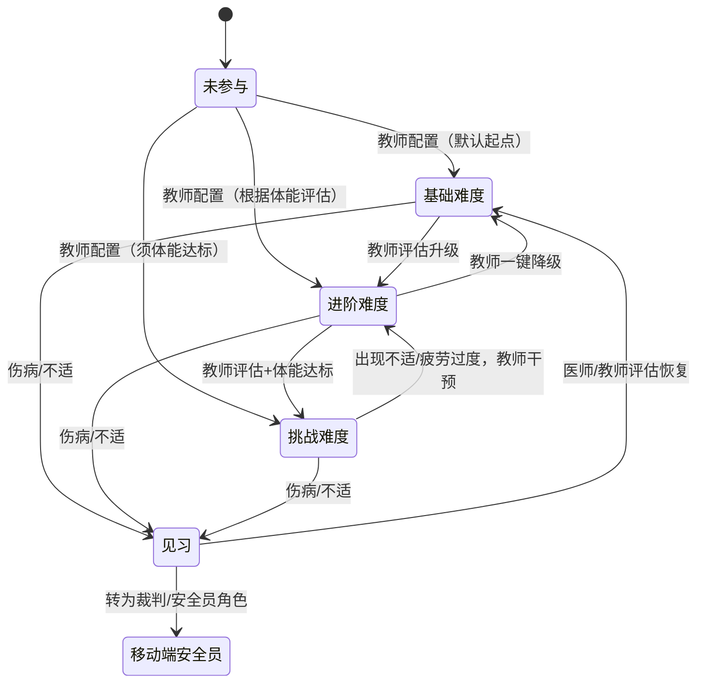
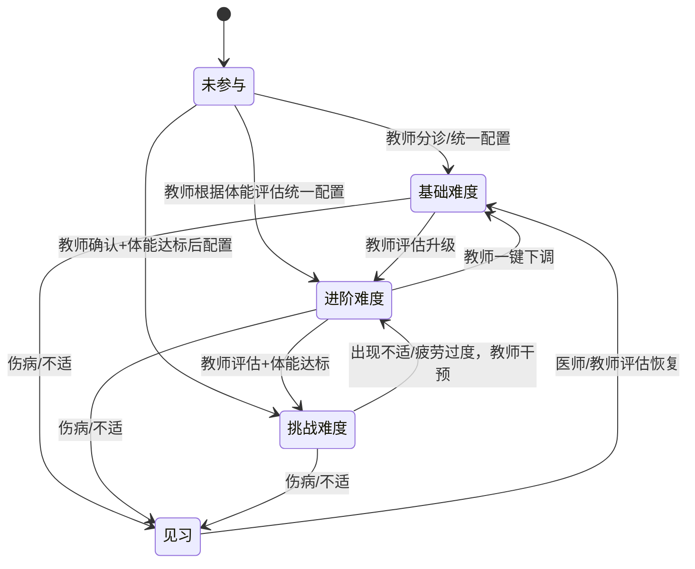
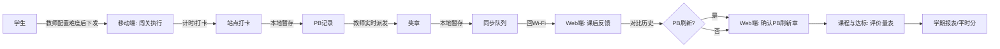
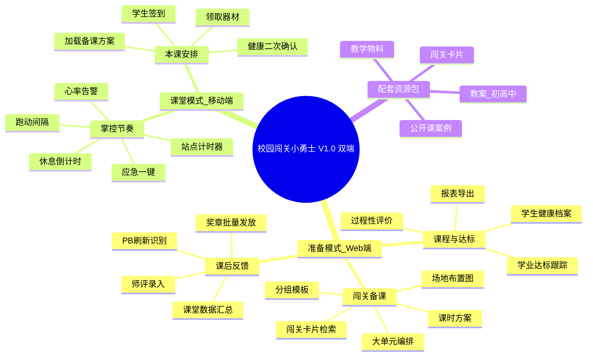
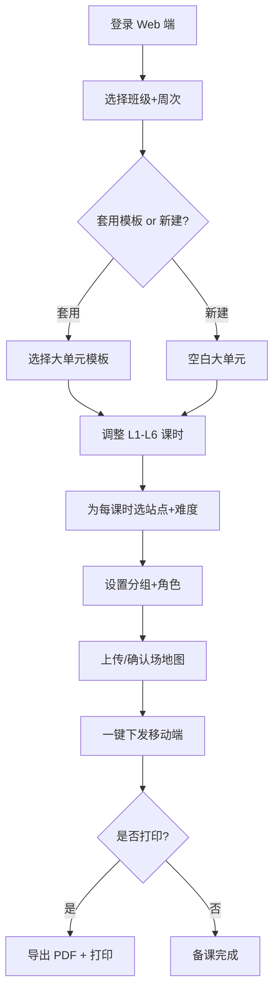
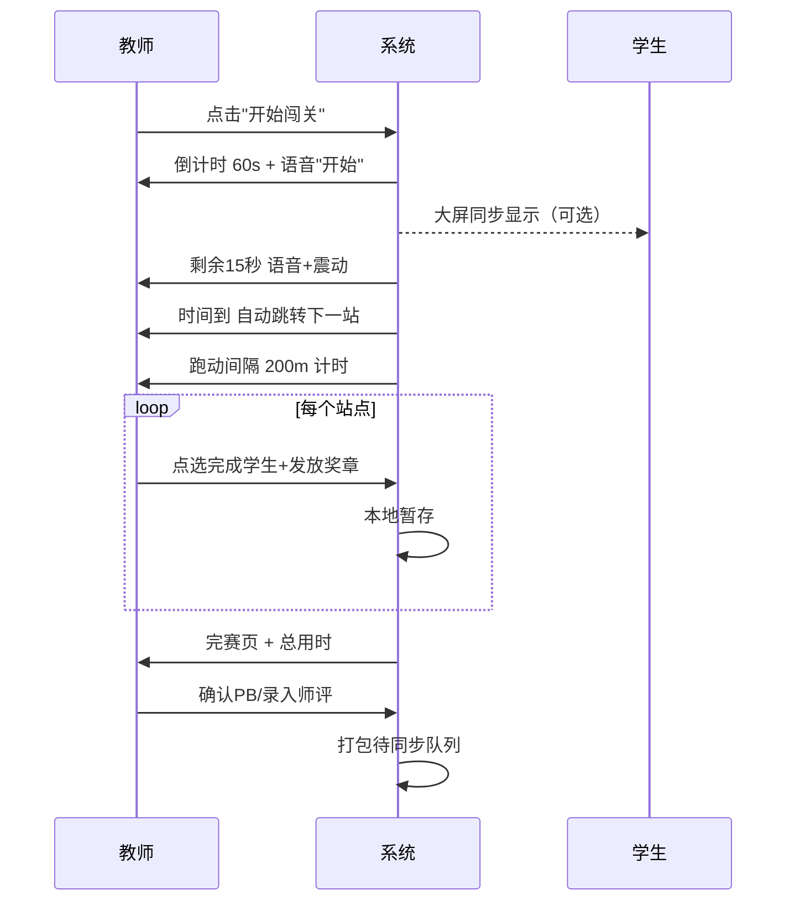

# 校园闯关小勇士 · 产品需求文档 PRD V1.0

> **产品定位**：面向**小学 / 初中 / 高中**体育教师的**双端**循环体能闯关教学产品
> **版本**：V1.0（MVP · 数字资源包 + Web/移动双端框架）
> **文档日期**：2026-09-14
> **核心范式**：分段跑动 + 8 个循环体能站点 + 三级分层 + 闯关奖章 + 个人 PB 记录
> **关键差异**：不竞速排名，奖励自我进步；校园化降强度，器材复用学校已有器材
> **品牌合规**：产品名、课程名、物料中**禁止使用 HYROX 商标**

---

## ⚡ 双端产品形态（V1.0 关键架构决策）

| 端 | 模式 | 核心场景 | 设备 | 网络要求 | 关键约束 |
|----|------|---------|------|---------|---------|
| **Web 端** | **准备模式** | 备课、课后反馈、课程与达标管理 | PC / 大屏 | 在线为主 | 信息密度高、批量操作、打印导出 |
| **移动端** | **课堂模式** | 本课安排、闯关执行、节奏掌控 | 手机 / 平板（教师端） | **离线优先** | 大字号、单手可达、防误触、湿手可操作 |

**双端分工原则：**

```
┌─────────────────────────────────────────────────────────────┐
│  准备模式（Web 端）            课堂模式（移动端）           │
│  ─────────────────           ─────────────────             │
│  • 课前做得多              • 课中做得快                    │
│  • 看得多、选得细          • 点得少、看得清                │
│  • 打印 / 导出 / 备份      • 扫码 / 计时 / 派发            │
│  • 数据汇总 / 报表         • 实时数据 / 即时反馈           │
│  • 一次用 30 分钟+         • 一次用 40 分钟（全课）        │
└─────────────────────────────────────────────────────────────┘
```

---

## 〇、需求体检结论

| 信号 | 状态 | 说明 |
|------|------|------|
| 需求来源 | ✅ 已澄清 | 新课标「学练赛评一体化」+ 教师公开课/课后服务真实场景 + 教师圈层已有自发实践 |
| 用户价值 | ✅ 已澄清 | 旧方案：教师手工备课 + 班级统测 → 学生划水、弱生边缘化；新方案：闯关 + PB 自我对比 |
| 成功定义 | ⚠️ 部分澄清 | 需补：试点学校公开课落地数、NPS、付费续费率（详见待确认项） |
| 品牌版权 | ⚠️ 必须前置 | 不能使用 HYROX 作为产品名/课程名（详见 §4.1） |
| 安全合规 | ⚠️ 必须前置 | 分层 + 心率管控 + 应急流程（详见 §3.6、§4.1） |

> **体检结论**：可立项；但**安全、版权、课标合规**三个红线必须在 §4.1 中显式落地，否则评审不通过。

---

## 一、信息缺口与假设清单

### 1.1 已确认事项

1. **产品命名**：**「校园闯关小勇士」**（已确认）
2. **目标用户**：小学/初中/高中体育教师
3. **客户**：学校、教育局教研、课后服务服务商
4. **MVP 边界**：数字资源包（教案+闯关卡片+任务卡+评价量表）

### 1.2 待确认关键假设

| # | 假设项 | 默认建议值 | 影响范围 |
|---|--------|-----------|---------|
| A1 | 学段版本 | V1.0 同时交付**小学版 + 初中版 + 高中版** | 教研工作量、闯关卡片、教案库 |
| A2 | 大单元课时 | 6 课时（4 练习+1 完整闯关+1 展示赛） | 教案库编排 |
| A3 | 收费模式 | 按学校/年级包年授权 | 商业化 |
| A4 | 器材策略 | 零新增器材版为主，器材包作可选增值 | 闯关卡片设计 |
| A5 | PB 工具 | V1.0 纸质模板，V1.5 数字化 | 产品节奏 |
| A6 | 评价对接 | 对接学校过程性评价（平时分），不直接绑定中考 | 教师话术 |

---

## 二、PRD 主体

### 一、概述

#### 1.1 产品概述及目标

##### 1.1.1 背景介绍

**行业痛点：**

| # | 痛点 | 来源 |
|---|------|------|
| 1 | 体能课枯燥，学生划水、弱生边缘化 | 一线教师访谈、北上深多所中学公开课反馈 |
| 2 | 备课成本高，分层循环体能方案缺乏标准化产品 | 教研组普遍痛点 |
| 3 | 新课标要求"学练赛评一体化"，但缺乏一体化工具 | 《义务教育体育与健康课程标准 2022》《高中体育与健康课程标准 2017 修订》 |
| 4 | 闯关式体能训练模式在教师圈层自发传播 | 短视频平台观测 |

**机会窗口：**
- 2024–2026 课后服务、特色校本课程需求增长
- 体育名师工作室、区域教研员有公开课/课题素材需求
- 国内目前**无标准化、可商用、含安全体系的循环体能教学产品**

##### 1.1.2 产品概述

**产品定义：**
「校园闯关小勇士」是一套面向小学/初中/高中体育教师的**数字教案资源包 + 闯关赛事机制 + 过程性评价工具**的教学产品。

- **核心范式**：分段跑动（每站之间 200–400m 慢跑/快走） + 8 个循环体能站点 + 三级分层 + 闯关奖章 + 个人 PB 记录
- **关键差异**：**不竞速排名，奖励自我进步**；**校园化降强度**，器材复用学校已有器材
- **品牌合规**：产品名、课程名、物料中**禁止使用 HYROX 商标**

**产品定位：**
- **品类**：体能教学特色拓展课程包（不是刚需必修课）
- **价值主张**：让体育老师 0 备课开课，让学生"和自己比"主动参与
- **目标市场**：B 端学校 / 教育局教研 / 课后服务运营商

##### 1.1.3 产品目标

**业务目标（V1.0，6 个月内）：**
- [ ] 完成 4 所学校（2 初 + 2 高）公开课试点
- [ ] 累计付费学校 ≥ 30 所
- [ ] 教师 NPS ≥ 40
- [ ] 0 起运动伤害责任投诉

**用户目标：**

| 角色 | 目标 | 衡量 |
|------|------|------|
| 体育教师 | 0 备课开课、有公开课素材、有过程性评价依据 | 备课时长、单课学生参与率、教研材料产出数 |
| 学生 | 主动参与、看得见自己的进步、不怕出丑 | 出勤率、闯关完赛率、PB 刷新率、自评信心分 |
| 教研员/校长 | 有特色校本课程、安全合规、有数据可汇报 | 公开课次数、安全事故 0、教研论文产出 |

##### 1.1.4 目标用户

**主用户：**
- 一线**小学 / 初中 / 高中**体育教师（25–45 岁）
- 体育教研组长（决策影响者）

**次用户：**
- 区域教研员（B 端采购影响者）
- 学校教学副校长/校长（B 端采购决策者）
- 课后服务运营商（B 端分销）

**学员：**
- 初一–初三、高一–高三在校学生
- **特殊照顾**：伤病生、特异体质生、肥胖学生、内向学生（详见 §3.3.5）

#### 1.2 名词说明

| 术语 | 定义 |
|------|------|
| 闯关小勇士 | 参与本课程的学生身份 |
| 闯关站 | 单课时内的循环站点练习 |
| 大单元闯关赛 | 4–6 课时为一个完整教学单元，最后一节课完整跑 + 8 站闯关 |
| 站点（Station） | 8 个循环体能站点之一，单站点 30–60 秒训练 |
| 三级难度 | 基础（保底）/ 进阶（标准）/ 挑战（拔高） |
| PB（Personal Best） | 个人最佳成绩，只跟自己比 |
| 奖章 | 单节课过程奖励，三类（技能/素养/赛季） |
| 成长手册 | 纸质/电子的学生闯关记录册，含奖章粘贴区 + PB 记录 |
| 4 人小组角色 | 选手 / 裁判 / 安全员 / 记录员，每轮轮换 |
| **准备模式** | **Web 端**教师备课、反馈、达标管理的总称 |
| **课堂模式** | **移动端**教师在操场上课、计时、派发、掌控节奏的总称 |
| **双端协同** | Web 端备课数据 → 移动端课堂执行 → 课堂数据回传 Web 端 → 形成闭环 |
| **离线课堂** | 移动端在无网络/弱网操场环境下完成课堂全流程，课后回 Wi-Fi 自动同步 |

#### 1.3 角色及权限（含双端可见性）

| 角色 | 系统侧账号 | Web 端（准备模式） | 移动端（课堂模式） |
|------|-----------|-------------------|-------------------|
| 系统管理员（产品方） | admin | ✅ 全部 | ❌ 不需要 |
| 区域教研管理员 | region_admin | ✅ 数据看板、教研下发 | ❌ 不需要 |
| 校级管理员（教研组长） | school_admin | ✅ 校内账号、教案分发、数据看板 | 👁 只读：实时课堂巡视（可选） |
| 体育教师 | teacher | ✅ 备课、课后反馈、达标管理、打印 | ✅ 本课安排、掌控节奏、扫码发章 |
| 学生（V2.0） | student | 👁 自评、查看成长档案 | ❌ V1.0 不发学生端 |
| 家长（V2.0） | parent | 👁 查看孩子成长手册 | ❌ |

> **关键设计**：V1.0 教师一人双端（一个账号同时登录 Web + 移动），数据互通；学生端 V2.0 引入。

#### 1.4 文档阅读对象

| 角色 | 阅读重点 |
|------|---------|
| 教研组长/校长 | §1.1.3 业务目标、§4.1 安全合规、§5 验收标准 |
| 一线体育教师 | §2.6 双端功能对照表、§3 按端分块的功能需求 |
| 产品/研发 | §1.5 双端架构、§2.2 协同流程图、§3 全章、§4.6 双端适配 |
| UI/交互设计 | §3.3 移动端界面、§4.6 触屏/防误触/大字号 |
| 安全/法务 | §4.1 安全与合规、§4.7 数据合规（双端） |

#### 1.5 双端总览



**双端数据流向：**

| 数据类型 | 方向 | 触发时机 |
|---------|------|---------|
| 备课方案 / 课时包 | Web → 移动 | 课前 |
| 课时元数据（站点/难度/分组） | Web → 移动 | 课前 |
| 学生健康档案 | Web → 移动 | 课前 |
| 课堂实时数据（PB/奖章/打卡） | 移动 → Web | 课后回 Wi-Fi |
| 课中拍照/录音 | 移动 → Web | 课后回 Wi-Fi |
| 过程性评价汇总 | Web → 学校系统 | 周/月 |

---

### 二、产品描述

#### 2.1 产品需求描述

V1.0 提供**双端数字工具 + 配套资源包**，覆盖教师"课前—课中—课后—学期末"全工作流。

**双端核心模块：**

| 端 | 一级模块 | 二级功能 |
|----|---------|---------|
| **Web 端（准备模式）** | 闯关备课 | 大单元编排、课时方案、闯关卡片、分组模板、场地布置图 |
| | 课后反馈 | 课堂数据汇总、PB 刷新识别、奖章批量发放、师评录入 |
| | 课程与达标 | 学生健康档案、过程性评价量表、学业达标跟踪、报表导出 |
| **移动端（课堂模式）** | 本课安排 | 加载备课方案、确认分组、学生签到、领取器材 |
| | 掌控节奏 | 站点计时器、跑动间隔、休息倒计时、心率告警、应急呼叫 |

**配套资源包（不依赖联网）：**

1. **教案资源包**：**小学版 + 初中版 + 高中版**，每版 6 课时大单元，含单课时教案、大单元教学设计、PPT、场地布置图
2. **闯关卡片**：8 个站点 × 3 级难度 × 3 学段 = **72 个标准动作方案 + 144+ 替代动作**（小学版难度再降一档，包含更多游戏化动作）
3. **教学物料包**：学生成长手册、奖章素材、PB 记录卡、过程性评价量表、引导话术库

> **关键说明**：V1.0 教案/物料可**完全离线使用**（即提供 PDF/Word/PPT 直接打印）；双端工具在弱网/无网操场环境下也能完成课堂全流程，课后回 Wi-Fi 自动同步。

#### 2.2 产品整体流程

##### 2.2.1 主流程：双端协同一节课



##### 2.2.2 子流程：移动端掌控节奏（课堂模式核心）



##### 2.2.3 状态转换：学生闯关进度（双端联动）



##### 2.2.3 状态转换：学生闯关进度



##### 2.2.4 数据流图：PB 与奖章的双端闭环



#### 2.3 全局说明

##### 2.3.1 异常处理（教学场景）

| 异常 | 处理 | 端 |
|------|------|----|
| 学生被配置了超出能力的难度 | 教师需主动调整配置；若课上出现明显疲劳/心率异常立即降级并登记 | 移动端 |
| 学生拒绝闯关 | 不强制；安排裁判/安全员/记录员角色，仍可拿素养类奖章 | 移动端 |
| 学生出现运动不适 | 立即停止该生闯关，转休息区，启动应急流程（详见 §4.1.2） | 移动端一键 |
| 站点器材不足/损坏 | 切换至站点内置的"零器材替代方案" | 移动端一键切换 |
| 极端天气 | 转室内理论课或取消，提供"理论替代课时包" | Web 端 |
| 教师临时无法上课 | 教案含"代课教师 1 页速通卡"，可由非专业教师带课 | Web + 移动 |
| **移动端弱网/无网** | **所有操作本地暂存，恢复网络后自动同步；同步前显示"待同步"角标** | 移动端 |
| **移动端设备没电/故障** | **纸质卡片兜底（V1.0 已配），课后回 Web 端手工补录** | Web 端兜底 |
| **Web 端故障** | **本地已缓存教案 PDF，可直接打开使用** | Web 端降级 |
| **备课方案未及时同步到移动端** | **移动端自动检测最新版本，提示"是否下载新课包"** | 双端 |
| **心率遥测手表断连** | **降级为自觉 RPE 评估，5 级量表（详见 §3.6.2）** | 移动端 |

##### 2.3.2 列表规则

- 教案列表（Web 端）：按学段 → 年级 → 课时 → 难度
- 闯关卡片（Web 端）：按部位（心肺/上肢/下肢/核心/灵敏）→ 难度 → 所需器材
- 奖章列表（双端）：按类别（技能/素养/赛季）→ 授予标准
- PB 列表（Web 端教师视图）：按学生 → 时间倒序，只展示个人历史，不展示班级排行
- PB 列表（移动端）：仅当前学生个人时间线
- 本课安排（移动端）：课时 → 站点顺序 → 难度标签 → 学生分组

##### 2.3.3 全局交互

- **禁用**：全校/全班成绩排行榜、横向竞速排行榜
- **鼓励**：学生自评 + 教师简短评语 + 自愿分享
- **课堂口令**：闯关开始口令 / 站点切换口令 / 完赛口令统一进入教案
- **语言**：简体中文；运动术语双标注（如"实心球俯卧撑 / Med Ball Push-up"）

**双端交互差异（重要）：**

| 维度 | Web 端（准备模式） | 移动端（课堂模式） |
|------|--------------------|--------------------|
| 字号 | 标准 14–16px | **大字号 18–24px**，操场强光可读 |
| 主操作 | 鼠标点击 + 键盘快捷键 | **触屏 + 长按防误触**，关键操作需二次确认 |
| 信息密度 | 高（表格、列表、详情并存） | 低（一屏一主任务） |
| 操作反馈 | Toast + 进度条 | **语音播报 + 震动 + 大字号**（操场嘈杂） |
| 输入方式 | 文本输入 + 下拉 + 多选 | **滑选 + 单选 + 扫学生胸卡/手环** |
| 续航 | 不敏感 | **节电模式**：自动息屏保活、电量 <20% 提示 |
| 干手/湿手 | 不敏感 | **支持湿手/手套操作**，点击区 ≥ 44×44 pt |
| 横竖屏 | 自适应 | **横屏优先**（站点地图 + 计时） |

#### 2.4 产品版本规划

| 版本 | 时间 | 范围 | 商业形态 |
|------|------|------|---------|
| **V1.0 MVP** | 0–6 个月 | **双端数字工具（Web 准备模式 + 移动课堂模式）+ 教案资源包 + 物料** | 学校包年 ¥[待确认] |
| **V1.5** | 6–9 个月 | + 学生扫码端（微信小程序）+ 班级赛事系统雏形 | 学校账号数计费 |
| **V2.0** | 9–18 个月 | + 教师线上认证 + 班级赛事完整版 + 评价对接学校系统 | SaaS 年费 |
| **V3.0** | 18+ 个月 | + 区域数据看板 + 智能推荐分层 + 校际挑战赛 | 平台分润 |

**V1.0 双端交付节奏：**

| 阶段 | 端 | 交付物 |
|------|----|-------|
| M1 (第 1–2 月) | Web | 闯关备课 + 课后反馈（基础版）+ 教案库 |
| M2 (第 2–4 月) | Web + 移动 | + 移动端 本课安排 + 掌控节奏 + 离线课堂 |
| M3 (第 4–6 月) | Web + 移动 | + 课程与达标 + 评价量表 + 公开课案例库 |

#### 2.5 产品框架



#### 2.6 功能清单（双端映射）

| # | 功能模块 | 端归属 | V1.0 范围 |
|---|---------|--------|----------|
| **F1** | 闯关备课 | **Web** | ✅ 完整：大单元编排 + 课时方案 + 分组模板 + 场地图 |
| **F2** | 课后反馈 | **Web** | ✅ 完整：数据汇总 + PB 识别 + 批量发章 + 师评 |
| **F3** | 课程与达标 | **Web** | ✅ 完整：健康档案 + 评价量表 + 达标跟踪 + 报表 |
| **F4** | 本课安排 | **移动** | ✅ 完整：备课包加载 + 签到 + 二次健康确认 |
| **F5** | 掌控节奏 | **移动** | ✅ 完整：计时器 + 间隔 + 心率告警 + 应急 |
| F6 | 闯关卡片 | 双端 | ✅ 完整（72 套 + 144 替代） |
| F6 | 教案库（离线 PDF/PPT） | 双端 | ✅ 完整 |
| F7 | 教学物料包 | Web（可下载） | ✅ 完整 |
| F8 | PB 与奖章过渡 | 移动（采集+派）→ Web（汇总+确认） | ✅ 数字化全流程 |
| F9 | 安全保障 | 双端协同 | ✅ 健康档案+心率告警+应急一键+器材安全 |
| F10 | 公开课案例库 | Web | ✅ 视频+教案 ≥ 6 例 |
| F11 | 评价量表 | Web | ✅ Word/Excel/在线三态 |
| F12 | 过程性评价对接 | Web | ✅ 在线量表 → 自动折算平时分 |
| F13 | 离线课堂 | 移动 | ✅ 弱网/无网全功能 |
| F14 | 扫码发章（学生胸卡/手环） | 移动 | ✅ V1.0 必选 |
| F15 | 教师线上认证 | 双端 | ❌ V2.0 |
| F16 | 班级赛事系统 | Web + 移动 | ❌ V2.0 |
| F19 | 区域数据看板 | Web | ❌ V3.0 |
| F20 | 学生端 / 家长端 | 移动 | ❌ V2.0 |

**端归属原则：**

| 端 | 适合的功能 | 不适合的功能 |
|----|-----------|------------|
| Web 端 | 数据密集、批量操作、打印导出、长流程决策、报表 | 实时计时、扫码、湿手操作、强光下阅读 |
| 移动端 | 计时、扫码、即时派发、现场决策、应急 | 大段文字录入、复杂筛选、打印 |

---

### 三、功能需求

> **本章结构变化**：每个功能模块标注**端归属（Web / 移动 / 双端）**，新增 §3.2 闯关备课、§3.3 课后反馈、§3.4 课程与达标三个 Web 端独有模块，新增 §3.5 本课安排、§3.6 掌控节奏两个移动端独有模块。

#### 3.1 F1 闯关备课（**Web 端 · 准备模式**）

##### 3.1.1 描述
Web 端核心模块。教师从大单元到课时，从站点到分组，一站式完成备课，并一键下发至移动端。

##### 3.1.2 用户故事
> 作为体育教师，我希望能在一小时内完成下周 6 节课的备课，并且能直接同步到手机上，带着手机就去操场。

##### 3.1.3 端归属与功能清单

| 子功能 | 说明 |
|--------|------|
| 大单元编排 | 选择学段/年级 → 套用模板 → 微调课时主题（**小学/初中/高中三套独立模板**） |
| 课时方案 | L1-L6 课时拖拽排序，编辑每课时主题、时长、站点组合（**小学采用微课时，2 课时 = 初高中 1 课时**） |
| 闯关卡片检索 | 按部位/难度/器材筛选，支持预览动作视频（**小学额外增加游戏化站点**） |
| 分组模板 | 4 人一组，角色轮换规则，可按性别/体能微调（**小学增加“安全员/加油员”角色占比**） |
| 场地布置图 | 上传操场平面图，拖拽摆放站点位置，导出 PDF |
| 一键下发 | 备课包打包 → 推送至教师移动端 + 班级二维码（学生扫码预览） |

##### 3.1.4 三学段差异说明（**重要**）

| 维度 | 小学版 | 初中版 | 高中版 |
|------|--------|--------|--------|
| **课时粒度** | 微课时 15-20 min/节，6 节微课时 ＝ 3 节传统课时 | 40 min/节 × 6 课时 | 40 min/节 × 6 课时 |
| **课时总量** | 6 节微课时 | 6 课时 | 6 课时 |
| **站点难度** | 难度降一档：基础版跳绳 20s、俯卧撑跪姿 3 次；减少农夫行走 | 3 级难度 × 8 站 | 3 级难度 × 8 站 |
| **动作选择** | 减少器械、**增加游戏化动作**（嘟姓姓、颜色包、小障碍跑） | 器械+徒手 | 器械+徒手+可选负重 |
| **课堂结构** | **游戏导入 → 闯关 → 游戏放松**，不开计时器 | 导入 → 热身 → 闯关 → 记录 → 放松 | 导入 → 热身 → 闯关 → 记录 → 放松 |
| **心率管控** | 不采心率，以**自觉 RPE + 教师观察**为主 | RPE + 可选心率手表 | RPE + 推荐心率手表 |
| **安全约束** | 一二年级**禁止高强度间歇**，跳绳连续不超过 30s | 限制 85% 最大心率 | 限制 85% 最大心率 |
| **评分重点** | **参与率 + 体验度 + 同伴反馈**（不记 PB） | 完赛率 + PB 进步 + 素养 | 完赛率 + PB 进步 + 素养 |
| **家长沟通** | 需**家长告知书+家长群反馈** | 家长告知书 | 家长告知书 |

##### 3.1.5 界面/交付物

**Web 端界面结构：**

| 一级导航 | 二级页面 | 关键操作 |
|---------|---------|---------|
| 备课首页 | 我的备课、本周课表、模板库 | 新建/复制/分享备课 |
| 大单元编排 | 学段选择、课时甘特图、站点拖拽 | 拖拽式编辑 |
| 闯关卡片 | 列表/卡片切换、筛选器、动作视频弹窗 | 搜索、收藏、对比 |
| 分组 | 自动分组、手动调组、按 PB 历史智能分组（V2.0） | 一键导出花名册 |
| 场地图 | 上传底图 → 拖拽站点图标 → 标注跑动路线 | 导出 PDF / 打印 A3 |
| 我的课表 | 周/月视图、班级维度、备课完成度 | 一键下发 |

##### 3.1.6 业务流程



##### 3.1.7 数据字典（备课方案）

| 字段 | 类型 | 必填 | 说明 | 示例 |
|------|------|------|------|------|
| plan_id | string | Y | 备课方案 ID | P-2026-T8-L3 |
| teacher_id | string | Y | 教师 ID | T001 |
| class_id | string | Y | 班级 ID | C-8-3 |
| week | int | Y | 周次 | 12 |
| track | enum | Y | 小学/初中/高中（primary_school / middle_school / high_school） | middle_school |
| lessons | array[object] | Y | 6 课时结构 | [...] |
| grouping_strategy | enum | Y | random/balanced/manual | balanced |
| venue_map_id | string | N | 场地图 ID | VM-001 |
| sync_status | enum | Y | pending/synced/expired | synced |
| synced_device_id | string | N | 接收设备 | iPad-A4 |

##### 3.1.8 异常/分支
- 网络中断时下发：自动进入"待同步队列"，恢复后推送
- 移动端接收后教师修改 Web 端：移动端自动提示"方案已更新，是否下载新版？"
- 备课方案冲突（多人同时编辑）：悲观锁，提示"已被 X 编辑"

---

#### 3.2 F2 课后反馈（**Web 端 · 准备模式**）

##### 3.2.1 描述
课后 Web 端汇总课堂数据：移动端暂存的 PB、奖章、师评等数据自动同步后，教师在此完成"反馈—确认—导出"。

##### 3.2.2 用户故事
> 作为体育教师，我下课后回到办公室，打开 Web 端就能看到今天每位学生的 PB、奖章、我的备注，10 分钟完成反馈，5 分钟导出报表给班主任。

##### 3.2.3 端归属与功能清单

| 子功能 | 说明 |
|--------|------|
| 课堂数据汇总 | 自动从移动端同步：PB、奖章、站点打卡、应急事件 |
| PB 刷新识别 | 系统自动对比历史 PB，标记"已刷新" |
| 奖章批量发放 | 一键确认移动端已派发的奖章；补发素养类章 |
| 师评录入 | 文本框（50–200 字）+ 标签选择（动作/态度/合作） |
| 学生自评 | 录入学生自评（移动端已填或此处补录） |
| 拍照/录音归档 | 移动端课中拍摄的照片、音频同步至此 |
| 反馈导出 | 单课时反馈 PDF / 班级周报 Excel |

##### 3.2.4 关键界面

| 页面 | 关键元素 |
|------|---------|
| 课堂数据看板 | 班级 PB 排行榜（仅个人，不公开）、奖章热力图、应急事件卡片 |
| PB 记录详情 | 每个学生的 PB 时间线 + 难度选择 + 站点完成度 |
| 奖章确认台 | 移动端已派发奖章的待确认队列 |
| 师评录入 | 学生列表 + 评分 + 标签 + 评语 |
| 反馈导出 | 选课时/班级 → 选模板 → 一键导出 |

##### 3.2.5 数据字典（课堂反馈记录）

| 字段 | 类型 | 必填 | 说明 |
|------|------|------|------|
| feedback_id | string | Y | 反馈记录 ID |
| lesson_id | string | Y | 课时 ID |
| class_id | string | Y | 班级 ID |
| sync_time | datetime | Y | 同步时间 |
| pb_records | array[object] | Y | PB 列表 |
| medals_pending | array[object] | Y | 待确认奖章 |
| teacher_comments | array[object] | N | 师评列表 |
| self_comments | array[object] | N | 自评列表 |
| emergency_events | array[object] | N | 应急事件 |
| media_files | array[string] | N | 照片/录音 URL |

---

#### 3.3 F3 课程与达标（**Web 端 · 准备模式**）

##### 3.3.1 描述
Web 端最高信息密度的模块，承载学生健康档案、过程性评价、学业达标跟踪、学期报表四大业务，是教研员/校长最看重的入口。

##### 3.3.2 用户故事
> 作为教研组长，我能在这里看到全校 12 个班的闯关进度、PB 趋势、奖章分布、学生健康档案，期末一键出报表。

##### 3.3.3 端归属与功能清单

| 子功能 | 说明 |
|--------|------|
| 学生健康档案 | BMI、伤病史、特异体质、家长知情同意签字 |
| 过程性评价量表 | 5 维度自动加权，PB 进步幅度占 30%（不拼速度） |
| 学业达标跟踪 | 对接《国家学生体质健康标准》，闯关进度可视化 |
| 学期报表导出 | 班级/个人/年级三维度，PDF + Excel 双格式 |
| 教研材料生成 | 一键生成"公开课汇报 PPT"、"校本课程申报书"草稿 |

##### 3.3.4 关键界面

| 页面 | 关键元素 |
|------|---------|
| 学生健康档案 | 班级名册 + BMI 雷达图 + 禁忌标签 + 家长签字状态 |
| 过程性评价 | 5 维度雷达图（个人）/ 热力图（班级）+ 平时分自动折算 |
| 学业达标 | 体质健康项目达标率 + 闯关完成度 + 趋势折线 |
| 学期报表 | 班级报表 / 个人成长档案 / 年级汇总 三视图 |
| 教研材料 | 模板库 → 选课时 → 一键套用 PPT 框架 |

##### 3.3.5 数据字典（学生健康档案）

| 字段 | 类型 | 必填 | 说明 |
|------|------|------|------|
| student_id | string | Y | 学号 |
| name | string | Y | 姓名 |
| class_id | string | Y | 班级 ID |
| height_cm | int | N | 身高 |
| weight_kg | int | N | 体重 |
| bmi | float | 自动 | BMI |
| injury_history | array[string] | N | 既往损伤 |
| chronic_disease | array[string] | N | 慢性病 |
| special_status | enum | N | normal/recovery/disability |
| parent_consent | bool | Y | 家长签字 |
| parent_consent_date | date | N | 签字日期 |
| last_physical_date | date | N | 上次体检 |

##### 3.3.6 数据字典（过程性评价）

| 维度 | 指标 | 权重 | 数据来源 |
|------|------|------|---------|
| 课堂参与 | 出勤+主动参与角色 | 20% | 移动端签到+角色 |
| 闯关完赛率 | 完赛场次/总场次 | 20% | 移动端 PB 记录 |
| PB 进步幅度 | (本次 PB − 首次 PB) / 首次 PB | 30% | 移动端 PB 记录 |
| 奖章积累 | 奖章总数+类别多样性 | 20% | 移动端发章+Web 确认 |
| 安全/品德 | 素养类奖章数 | 10% | 教师评定 |

> **小学版过程性评价（4 维度，无 PB）**：
>
| 维度 | 指标 | 权重 | 数据来源 |
|------|------|------|---------|
| 课堂参与 | 出勤 + 主动参与角色（安全员/加油员） | **40%** | 移动端签到 + 角色记录 |
| 完赛体验 | 完赛动作完整度 + 游戏参与度 | **30%** | 移动端完成状态 + 教师评定 |
| 同伴反馈 | 互助、加油、安全提醒次数 | **20%** | Web 端教师评定 |
| 安全/品德 | 遵纪律、爱护器材 | **10%** | Web 端教师评定 |

---

#### 3.4 F4 本课安排（**移动端 · 课堂模式**）

##### 3.4.1 描述
教师到达操场后，打开移动端，加载今日备课包，快速完成"签到—分组—确认"三步，为掌控节奏做准备。

##### 3.4.2 用户故事
> 作为体育教师，我从办公室出门前在手机上加载好今天课表，走到操场 1 分钟内开始签到，5 分钟内全班进入闯关状态。

##### 3.4.3 端归属与功能清单

| 子功能 | 说明 |
|--------|------|
| 加载备课方案 | 扫描二维码 / 自动同步 / 离线缓存 |
| 学生签到 | 扫胸卡 / 手环 / 手选，支持离线签到 |
| 健康二次确认 | 显示 BMI 偏高、伤病学生名单，教师口头确认 |
| 分组确认 | 显示今日分组，临时调整（学生请假/转班） |
| 器材清点 | 按站点清单勾选，确认器材到位 |
| 一键开始闯关 | 进入"掌控节奏"模块 |

##### 3.4.4 关键界面（移动端）

| 页面 | 关键元素 | 设计要点 |
|------|---------|---------|
| 今日课表 | 课时名称、班级、时长、剩余时间 | 大字号、卡片式 |
| 学生签到 | 头像 + 学号 + 状态（已到/请假/见习） | 扫一扫 + 列表 |
| 健康二次确认 | 红色警示卡：伤病/BMI 偏高学生 | 大红字 + 头像 |
| 分组 | 4 人小组可视化 | 拖拽调组（防误触：长按 1s 才可拖） |
| 器材 | 8 站点清单 + 勾选 | 大复选框 + 器材图标 |
| 开始闯关 | 主按钮，绿底白字 | 占屏 1/3 高度 |

##### 3.4.5 业务流程

```mermaid
flowchart TD
    A[打开移动端] --> B[加载备课方案]
    B --> C{在线?}
    C -->|是| D1[同步最新版本]
    C -->|否| D2[使用本地缓存]
    D1 --> E[学生签到]
    D2 --> E
    E --> F[健康二次确认]
    F --> G[分组确认]
    G --> H[器材清点]
    H --> I[点击"开始闯关"]
    I --> J[进入掌控节奏]
```

##### 3.4.6 数据字典（本课安排）

| 字段 | 类型 | 必填 | 说明 |
|------|------|------|------|
| lesson_id | string | Y | 课时 ID |
| class_id | string | Y | 班级 ID |
| sign_in | array[object] | Y | 签到列表 |
| health_alerts | array[object] | Y | 健康警示 |
| grouping | array[object] | Y | 分组结果 |
| equipment_check | array[object] | Y | 器材清点 |
| start_time | datetime | Y | 闯关开始时间 |
| teacher_id | string | Y | 教师 ID |
| device_id | string | Y | 设备 ID |

##### 3.4.7 异常/分支
- 备课包未同步：移动端显示"使用离线版"或"立即下载"
- 学生临时加入：移动端快速录入姓名+选难度
- 设备没电：纸质签到表兜底（已配），课后 Web 补录

---

#### 3.5 F5 掌控节奏（**移动端 · 课堂模式**）

##### 3.5.1 描述
移动端核心模块。教师全课手持设备，掌控计时、心率、奖章、应急，是体育课的中枢神经。

##### 3.5.2 用户故事
> 作为体育教师，我不需要看表，设备会语音播报"剩余15秒"、"换站"、"该休息了"，我只需要观察学生、点选发章、处理异常。

##### 3.5.3 端归属与功能清单

| 子功能 | 说明 |
|--------|------|
| 站点计时器 | 大字号倒计时 + 语音播报 + 震动提示 |
| 跑动间隔计时 | 站与站之间 200m 跑动计时 |
| 休息倒计时 | 强制休息 60s |
| 心率告警 | 蓝牙连接 Polar H10 等手表，超过阈值震动+红屏 |
| 实时发章 | 点选学生头像 + 选奖章类型，一键发放 |
| PB 录入 | 完赛自动记录总用时，可手动修正 |
| 应急一键 | 长按 3 秒启动 5 大场景处置流程 |
| 站点地图 | 横屏模式显示场地布置 + 当前站点位置 |

##### 3.5.4 关键界面（移动端）

| 页面 | 关键元素 | 设计要点 |
|------|---------|---------|
| 主计时器 | 大字号 60s 倒计时 + 进度环 + 语音 | 占屏 60%，强光可读 |
| 站点信息 | 当前站点名 + 难度 + 动作要点 | 简图+口诀 |
| 学生实时状态 | 头像网格 + 完成度色块 | 一眼看出谁掉队 |
| 发章面板 | 学生头像 + 奖章图标 | 长按 1s 才可点选（防误触） |
| 心率告警 | 红屏 + 震动 + 学生姓名 | 优先级最高，可穿透任何界面 |
| 应急面板 | 5 大场景按钮 + 校医电话 + 120 | 长按 3s 启动 |
| 完赛页 | 总用时 + PB 标记 + 自评入口 | 课堂内学生可看到自己成绩 |

##### 3.5.5 业务流程（站点轮换）



##### 3.5.6 数据字典（课堂实时事件）

| 字段 | 类型 | 必填 | 说明 |
|------|------|------|------|
| event_id | string | Y | 事件 ID |
| lesson_id | string | Y | 课时 ID |
| student_id | string | Y | 学生 ID |
| event_type | enum | Y | station_complete/medal_granted/pb_recorded/emergency |
| timestamp | datetime | Y | 触发时间 |
| difficulty | enum | Y | 难度 |
| station_id | string | N | 站点 ID |
| medal_type | string | N | 奖章类型 |
| pb_value | int | N | PB 秒数 |
| sync_status | enum | Y | pending/synced |
| device_id | string | Y | 设备 ID |

##### 3.5.7 异常/分支
- 心率手表断连：降级为 RPE 自觉评估 5 级量表
- 误触发章：发放后 10s 内可撤回
- 应急触发：长按 3s 二次确认，避免误触
- 设备没电：纸质卡片兜底（详见 §3.6.4）

---

#### 3.6 F6 闯关卡片（**双端共用**）

##### 3.6.1 描述
8 个站点，覆盖心肺、上肢、下肢、核心、灵敏五大维度。每个站点 3 级难度 + ≥3 个替代动作。Web 端备课检索、移动端课堂执行均调用同一份站点数据。

##### 3.6.2 8 站点设计（默认校园化版本，**禁止原版 HYROX 雪橇、滑雪机**）

| ID | 站点 | 小学版（难度降一档） | 初中版 | 高中版 | 器材 |
|----|------|---------|---------|---------|------|
| S01 | 跳绳+开合跳组合 | 20s 跳绳+8 开合跳（连续跳不超 30s） | 30s+10 → 45s+15 → 60s+20 | 30s+10 → 45s+15 → 60s+20 | 跳绳 |
| S02 | 实心球俯卧撑 | 3 次(跪姿) → 5 → 8 | 5(跪姿) → 10 → 15 | 5(跪姿) → 10 → 15 | 实心球 2kg |
| S03 | 标志桶敏捷梯 | 1 趟 → 2 趟 | 2 → 3 → 4 趟 | 2 → 3 → 4 趟 | 标志桶 6 个 |
| S04 | 沙袋农夫行走 | **不推荐**（换成“气球护送”） | 10m×1(2kg) → 15m×2(4kg) → 20m×2(6kg) | 同上 + 可选 8kg | 沙袋 |
| S05 | 仰卧起坐/卷腹 | 10 → 15 → 20 | 15 → 25 → 35 | 15 → 25 → 35 | 垫子 |
| S06 | 高抬腿+小步跑 | 15s → 20s → 30s | 20s → 30s → 40s | 20s → 30s → 40s | 无 |
| S07 | 药球(2kg)砸墙 | **不推荐**（换成“包包抱抱”） | 8 → 12 → 16 | 8 → 12 → 16 | 软药球 |
| S08 | 平衡垫单脚站+蹲 | 15s/腿 → 20s/腿 | 20s/腿 → 30s/腿 → 45s/腿 | 同上 | 平衡垫 |

##### 3.6.3 用户故事
> 作为体育教师，我希望同一站点能给出 3 级难度的动作清单和替代方案，让我能在同一课堂容纳体能差异大的学生。

##### 3.6.4 数据字典（闯关卡片元数据）

| 字段 | 类型 | 必填 | 说明 | 示例 |
|------|------|------|------|------|
| station_id | string | Y | 站点 ID | S01 |
| category | enum | Y | 心肺/上肢/下肢/核心/灵敏 | cardio |
| basic | object | Y | 基础动作 | {name, duration, count} |
| intermediate | object | Y | 进阶动作 | {name, duration, count} |
| advanced | object | Y | 挑战动作 | {name, duration, count} |
| equipment | array[string] | Y | 所需器材 | [jump_rope] |
| replace_actions | array[object] | Y | 替代动作 | [{name, when}] |
| contraindication | array[string] | Y | 禁忌人群 | [knee_injury, obesity_severe] |
| rest_sec | int | Y | 站后休息 | 60 |
| video_url | string | N | 动作示范视频（Web 端预览，移动端课前缓存） | https://... |

##### 3.6.5 异常/分支
- 器材不足：自动调用 `replace_actions[0]`
- 学生出现禁忌症状：教师跨站点调用其他低强度站点
- 双端同步：Web 端闯关卡片更新后，移动端下次课前自动拉取新版

---

#### 3.7 F7 教学物料包（**Web 端为主，移动端课前预加载**）

##### 3.7.1 学生成长手册（纸质 + Web 端数字化备份）
**纸质字段：**

| 区域 | 内容 |
|------|------|
| 封面 | 学生姓名、班级、学段、起始日期 |
| 我的目标 | 学生自填 1–2 个本学期目标 |
| 奖章粘贴区 | 按类别预留 30 个奖章位（技能 12/素养 12/赛季 6） |
| PB 记录表 | 每次完整闯关记录 1 行 |
| 自评/师评 | 每课 1 条 |
| 家长签字 | 学期末 1 次 |

**Web 端数字化：**
- 教师可选择将纸质成长手册内容数字化录入 F3 课程与达标
- V1.5 支持扫描纸质 PB 卡片 → 自动 OCR 识别

##### 3.7.2 PB 记录卡（每课时配发，离线兜底）

| 字段 | 类型 | 必填 | 示例 |
|------|------|------|------|
| date | date | Y | 2026-04-12 |
| difficulty | enum | Y | basic |
| total_time_sec | int | Y | 1320 |
| station_records | array[object] | Y | [{S01: ok, S02: ok, ...}] |
| pb_refreshed | bool | Y | true |
| medals_earned | array[string] | Y | [basic_pass, pb_refresh] |
| self_comment | string | N | 比上次快 1 分钟 |
| teacher_comment | string | N | 动作规范度有提升 |

**端归属**：移动端没电或故障时教师手工填写纸质卡片，课后回 Web 端 F2 课后反馈批量补录。

##### 3.7.3 奖章素材包（Web 端定义 + 移动端发放 + Web 端确认）

**A. 技能类（3 款）：**

| 奖章 | 授予标准 | 发放端 |
|------|---------|--------|
| 🥉 基础通关章 | 教师配置基础难度且规范完成 ≥ 6/8 站 | 移动端 |
| 🥈 进阶突破章 | 教师配置进阶难度且规范完成 ≥ 6/8 站 | 移动端 |
| 🥇 挑战勇者章 | 教师配置挑战难度且规范完成 ≥ 7/8 站 | 移动端 |

**B. 素养类（3 款）：**

| 奖章 | 授予标准 | 发放端 |
|------|---------|--------|
| 🟢 安全守护章 | 课前完成热身、未出现推挤、主动提醒同伴 1 次以上 | Web 端（课后评定） |
| 🟢 协作互助章 | 小组内帮助同伴 ≥ 1 次、无嘲讽行为 | Web 端（课后评定） |
| 🟢 坚毅坚持章 | 完成所选难度全程、未中途退出 | 移动端 |

**C. 赛季类（≥ 3 款）：**

| 奖章 | 授予标准 | 发放端 |
|------|---------|--------|
| 首闯启航章 | 第一次完整闯关 | 移动端 |
| PB 刷新章 | 本次用时短于历史最佳 | 移动端 |
| 全程完赛章 | 完整 8 站完成 | 移动端 |

##### 3.7.4 不同学生适配策略（Web 端预设 + 移动端引用）

| 学生类型 | 锁定难度 | 重点奖章 | 教师话术 |
|---------|---------|---------|---------|
| 体能薄弱/肥胖 | 基础 | 基础通关+坚毅 | 「坚持到底就是胜利」 |
| 中等普通 | 进阶 | PB 刷新+协作 | 「跟自己比，每天进步一点点」 |
| 体育尖子 | 挑战+带教 | 挑战勇者+安全守护 | 「动作质量比速度更重要」 |
| 怕丢人/内向 | 教师配置基础难度 | 教师配置基础难度 | 「可以小组结伴或单人闯关」 |
| 伤病/特异体质 | 见习 | 裁判/安全员/记录员专属 | 「今天你是安全员，依然能拿安全章」 |

##### 3.7.5 引导话术库（Web 端音频库 + 移动端调用）

- 闯关开始口令 / 换站口令 / 完赛口令 / 应急口令（统一语音模板，教师可选男女声）
- 加油话术 20 句（针对不同学生表现）
- **端归属**：音频存 Web 端，移动端课前预加载（可选，节省流量）

---

#### 3.8 F8 PB 与奖章的双端过渡（**纸质 → 移动端暂存 → Web 端汇总**）

**V1.0（双端 + 纸质兜底）：**

| 阶段 | 端 | 动作 |
|------|----|------|
| 课中 | 移动端 | 完赛 → 自动记 PB、本地暂存奖章 |
| 课中 | 移动端 | 设备没电/故障 → 纸质 PB 卡片兜底 |
| 课后 | Web 端 | 回到 Wi-Fi → 移动端自动同步 |
| 课后 | Web 端 | F2 课后反馈批量确认、纸质补录 |

**V1.5（小程序扩展）：** 微信小程序扫码记 PB、电子奖章墙
**V2.0（赛事系统）：** 班级排行榜（**仅 PB 进步幅度**，非绝对成绩）、校际挑战赛

---

#### 3.9 F9 安全保障模块（**双端协同，产品核心机制**）

##### 3.9.1 课前健康筛查（**Web 端录入 + 移动端提醒**）

**小学额外安全约束：**

- 一二年级**禁用**高强度间歇训练、**禁用**农夫行走/砸墙等负重动作、跳绳**连续不超 30s**
- 三年级以上可参考初中标准，但需教师加强口头询问（心慌/头晕）
- 小学生健康档案必须包含**家长知情同意书**（移动端课前可查）

**学生健康档案（Web 端 F3 课程与达标录入）：**

| 字段 | 类型 | 必填 | 说明 |
|------|------|------|------|
| student_id | string | Y | 学号 |
| name | string | Y | 姓名 |
| class_id | string | Y | 班级 ID |
| height_cm | int | N | 身高 |
| weight_kg | int | N | 体重 |
| bmi | float | N | 自动计算 |
| injury_history | array[string] | N | 既往损伤 |
| chronic_disease | array[string] | N | 慢性病 |
| special_status | enum | N | normal/recovery/disability |
| parent_consent | bool | Y | 家长签字 |
| last_physical_date | date | N | 上次体检 |

**双端联动机制**：
- BMI ≥ 28 或有禁忌的学生**默认锁定基础难度**
- 学生可主动申请升级但需教师评估（移动端课前提示教师口头确认）
- 移动端课中健康二次确认（见 F4 本课安排）红色警示卡提醒

##### 3.9.2 课中心率管控（**移动端实时监测**）

- 教师佩戴心率遥测手表（推荐 Polar H10），蓝牙连接移动端
- 学生自觉心率区间目标：最大心率 60–80%（最大心率 = 220 − 年龄）
- 超过 85% → 移动端 F5 掌控节奏 红屏 + 震动 + 语音告警
- **异常处理**：心率手表断连 → 自动降级为 RPE 自觉评估 5 级量表（Web 端预设）

##### 3.9.3 应急处置预案（**移动端一键启动**）

| 场景 | 第一处置（移动端） | 第二步 | 升级 |
|------|---------|-------|------|
| 扭伤/拉伤 | 停止+冰敷+抬高（语音引导） | 通知校医 | 120 |
| 头晕/心悸 | 立即坐下+测心率 | 平躺+通风 | 120 |
| 过度换气 | 引导慢呼吸 | 陪同观察 | 校医 |
| 哮喘发作 | 吸入器+坐位 | 通知家长 | 120 |
| 心脏骤停 | CPR+AED | 持续抢救 | 120 |

**移动端设计要点**：
- F5 掌控节奏 应急面板长按 3 秒启动（防误触）
- 一键拨打校医电话 + 120（无需解锁手机）
- 应急流程图解印在每份教案首页（Web 端可下载）

##### 3.9.4 器材安全（**双端共用 F6 闯关卡片配置**）

- ❌ 禁用：原版 HYROX 雪橇、滑雪机、大重量杠铃
- ✅ 推荐：跳绳、实心球（≤2kg）、标志桶、小哑铃（≤3kg）、沙袋（≤6kg）、瑜伽垫
- 器材清单由 F4 本课安排课前勾选确认（移动端）
- Web 端 F6 闯关卡片可维护器材库存与替换动作映射

---

#### 3.10 F10 公开课案例库（**Web 端**）

- ≥ 6 套已落地公开课视频+教案+反思
- 含**小学、初中、高中各 3 套**，共 9 套
- 教师可下载用作公开课/教研展示素材
- **端归属**：仅 Web 端，资源后台下载

---

### 四、非功能需求

#### 4.1 安全与合规

##### 4.1.1 品牌合规（**最高优先级**）

- ❌ **禁止**：产品名、课程名、文案、海报、域名、社媒账号出现 HYROX 商标
- ✅ **使用**：校园闯关小勇士等独立命名
- 法务审核：所有对外文案须法务过审
- 与 HYROX 官方**无任何关联**，不暗示、不攀附

##### 4.1.2 课标合规

- 课程目标锚定《义务教育体育与健康课程标准 2022》（**含小学 + 初中**）、《高中体育与健康课程标准 2017 修订》
- 评价指标对接《国家学生体质健康标准》
- 教研/德育评审材料中明示"教学目标为体能素养，非竞速竞技"

##### 4.1.3 学校安全合规

- 提供《学校采购安全评估清单》
- 教师使用前须阅读《教师速通手册》（纸质/电子）并签字
- 校方须签《家长告知书+免责声明》模板
- 教案内置安全责任清单（教师签字版）

##### 4.1.4 数据合规

- 学生健康档案属敏感个人信息
- 收集：明示告知+家长同意
- 存储：本地+加密；不接入第三方
- 销毁：毕业后按学校规章销毁

#### 4.2 统计需求（埋点）——**按端分类**

| 事件 | 触发时机 | 关键属性 | 端 |
|------|---------|---------|-----|
| plan_created | Web 备课方案创建 | plan_id, teacher_id, lesson_count | Web |
| plan_synced | 备课方案下发移动端 | plan_id, device_id, sync_time | Web → 移动 |
| lesson_open | 教师打开课时 | lesson_id, track, grade | Web / 移动 |
| sign_in | 学生签到 | student_id, status, timestamp | 移动 |
| station_started | 站点开始 | station_id, difficulty, group_id | 移动 |
| station_cleared | 站点完成 | station_id, difficulty, duration_sec | 移动 |
| pb_recorded | 录入 PB | student_id, difficulty, time_sec, pb_refreshed | 移动 → Web |
| medal_granted | 发放奖章 | medal_type, student_id, granted_by | 移动 → Web |
| heart_rate_alert | 心率告警 | student_id, bpm, threshold | 移动 |
| emergency_triggered | 应急启动 | scenario_type, severity | 移动 |
| injury_reported | 上报运动不适 | type, severity, action | 移动 |
| sync_pending | 待同步队列 | event_count, last_sync_time | 移动 |
| sync_completed | 同步完成 | event_count, duration_sec | 移动 → Web |
| feedback_submitted | 课后反馈提交 | lesson_id, teacher_comment_count | Web |
| report_exported | 报表导出 | report_type, format, student_count | Web |

> V1.0 埋点由教师后台手工填报；V2.0 自动采集。

#### 4.3 性能需求——**按端定义**

| 指标 | Web 端（准备模式） | 移动端（课堂模式） |
|------|--------------------|--------------------|
| 页面首屏 | < 2 秒 | < 1.5 秒 |
| 关键交互响应 | < 500ms | **< 100ms**（计时器、发章） |
| 离线首屏 | 不适用 | < 500ms（已缓存） |
| 离线操作响应 | 不适用 | < 200ms |
| 备课方案同步 | < 5s（10 课时） | 接收 < 3s |
| 大文件加载 | 教案 PDF < 3s、视频首帧 < 2s | 视频预加载 < 5s |
| 同步队列处理 | 不适用 | 1000 条事件 < 30s |
| 扫码响应 | 不适用 | < 1s |
| 并发 | 100 教师同时备课 | 1 教师 + 1 设备 |
| 电量消耗 | 不敏感 | **满电撑一节课 90min**（节电模式） |

#### 4.4 数据库设计（V1.5 之后）

> V1.0 纸质阶段无数据库；V1.5 引入后核心表：

```mermaid
erDiagram
    SCHOOL ||--o{ CLASS : has
    CLASS ||--o{ STUDENT : has
    STUDENT ||--o{ HEALTH_RECORD : has
    STUDENT ||--o{ PB_RECORD : has
    STUDENT ||--o{ MEDAL : earns
    TEACHER ||--o{ CLASS : teaches
    LESSON ||--o{ PB_RECORD : generates
    LESSON ||--o{ MEDAL : generates
    TEACHER ||--o{ DEVICE : binds
    PLAN ||--o{ LESSON : contains
    PLAN ||--|| DEVICE : synced_to

    STUDENT {
        string id PK
        string name
        string class_id FK
        enum special_status
    }
    HEALTH_RECORD {
        string student_id FK
        float bmi
        array injury_history
        bool parent_consent
    }
    PB_RECORD {
        string id PK
        string student_id FK
        string lesson_id FK
        enum difficulty
        int total_time_sec
        bool pb_refreshed
        datetime sync_time
    }
    MEDAL {
        string id PK
        string student_id FK
        enum medal_type
        date granted_date
        enum granted_end "移动端/Web"
        bool confirmed
    }
    DEVICE {
        string id PK
        string teacher_id FK
        enum platform "iOS/Android"
        string device_model
    }
    PLAN {
        string id PK
        string teacher_id FK
        string class_id FK
        int week
        enum sync_status "pending/synced"
    }
```

#### 4.5 系统集成

| 系统 | 方向 | 时机 |
|------|------|------|
| 学校医务室健康档案 | 双向（导入体检数据） | V2.0 |
| 智慧体育平台 | 双向（导出过程性评价） | V2.0 |
| 体质健康测试系统 | 单向（导入体测成绩） | V2.0 |
| 区域教研平台 | 单向（上报公开课案例） | V1.5 |
| 微信扫码登录 | 单向（教师/学生身份） | V1.5 |
| 蓝牙心率手表 | 单向（移动端接收） | V1.0 |

#### 4.6 双端适配要求（**重要**）

| 维度 | Web 端 | 移动端 |
|------|--------|--------|
| **响应式** | 1280×800 起步，向下兼容 1024×768 | 横屏 1024×768 起，竖屏 375×667 起 |
| **离线缓存** | 教案 PDF/PPT 本地缓存 30 天 | **完整一周课时包**（含站点视频/音频） |
| **触屏优化** | 鼠标优先，可选触屏 | **触屏优先**，44×44pt 最小点击区 |
| **扫码能力** | 登录扫码 | **签到扫码**（学生胸卡）+ **场地扫码**（站点 ID） |
| **续航管理** | 不敏感 | **节电模式**：自动息屏保活、电量 < 20% 提示教师 |
| **横竖屏** | 自适应 | **横屏优先**（站点地图 + 计时），竖屏用于签到/发章 |
| **湿手操作** | 不敏感 | 支持防误触长按、湿手识别（电容屏） |
| **环境光适应** | 标准 | **强光模式**（操场阳光）+ 抗反光屏幕贴膜推荐 |
| **声音反馈** | 浏览器音量 | **大音量 + 震动双通道**，操场嘈杂可达 |
| **账号体系** | 手机号 / 微信 | 手机号 / 微信（与 Web 同步），单教师双端共用 |

#### 4.7 数据同步策略（**关键**）

| 场景 | 触发 | 策略 |
|------|------|------|
| Web → 移动 备课方案下发 | Web 端点击"一键下发" | 推送 + 移动端确认接收 + 离线缓存 |
| 移动 → Web 课堂数据回传 | 移动端回到 Wi-Fi 自动检测 | 批量打包上传 + 冲突合并（Web 教师手动确认优先） |
| 移动端弱网 | 操作时检测到弱网 | 本地暂存 → 显示"待同步"角标 → 恢复后自动重试 |
| 移动端无网 | 完全离线 | 本地暂存 → 课后回 Wi-Fi → 自动同步 → 失败可手动重试 |
| 双端冲突 | 同一备课方案两端被改 | 悲观锁：Web 端编辑时锁定移动端只读；解锁后推送移动端 |
| 数据丢失兜底 | 移动端损坏/丢失 | Web 端拥有完整备课方案源，移动端可重新加载 |
| 离线缓存大小 | 移动端 | 单课时包 ≤ 50MB，含视频预加载可扩展至 200MB/周 |

---

### 五、附录

#### 5.1 验收标准与测试要点——**按端拆分**

| # | 模块 | Web 端验收 | 移动端验收 |
|---|------|-----------|------------|
| 1 | **F1 闯关备课** | 备课流程 < 5 分钟完成；方案可下发至 ≥3 移动端 | 接收备课包 < 3s；离线可正常打开 |
| 2 | **F2 课后反馈** | 反馈流程 < 10 分钟；批量补录支持 OCR（V1.5） | 课堂数据自动同步 ≥ 95% 成功率 |
| 3 | **F3 课程与达标** | 学生健康档案覆盖率 100%；评价量表自动生成 | 不适用 |
| 4 | **F4 本课安排** | 备课包可一键转换为移动端加载 | 签到 < 1 分钟完成全班；离线签到可用 |
| 5 | **F5 掌控节奏** | 不适用 | 计时器响应 < 100ms；语音+震动反馈必达；应急面板长按 3s 启动 |
| 6 | **F6 闯关卡片** | 闯关卡片版本号管理；可预览动作视频 | 课前自动预加载新课包 |
| 7 | **F7 教学物料包** | 全部物料可下载打印 | 不适用 |
| 8 | **F8 PB 与奖章过渡** | Web 端汇总、确认、补录；纸质数据 OCR 录入 | 移动端实时发章、本地暂存 |
| 9 | **F9 安全保障** | 健康档案合规；心率告警配置；应急流程可下载 | 应急一键 < 3s 启动；心率告警穿透界面 |
| 10 | **F10 公开课案例库** | ≥6 套完整视频+教案；可下载 | 不适用 |
| 12 | 教案完整性 | **小学 + 初中 + 高中各 6 课时**，三件套齐全 | 不适用 |
| 13 | 闯关卡片数量 | 8 站点 × 3 难度 × 3 学段 = **72 套方案** | 每站 ≥3 替代动作 |
| 14 | 品牌合规 | 全文搜索"HYROX"为 0 命中 | 移动端文案同样 0 命中 |
| 15 | 课标合规 | 教研专家+体育教研员联合评审通过 | 不适用 |
| 16 | 试点验证 | 4 所学校公开课落地，0 运动伤害事故 | 移动端 100% 离线可用 |
| 17 | 教师满意度 | 试点教师 NPS ≥ 40 | 移动端操作流畅度 NPS ≥ 50 |
| 18 | 双端同步 | 同步成功率 ≥ 95%；冲突可解决 | 离线缓存可用 7 天 |
| 19 | 性能指标 | 教案 PDF < 3s；视频首帧 < 2s | 计时器 < 100ms；签到 < 1s |
| 20 | 续航能力 | 不适用 | 满电撑一节课 90min |

#### 5.2 风险登记表

| # | 风险 | 等级 | 缓解措施 |
|---|------|------|---------|
| 1 | 品牌侵权 | 高 | 法务前置审核+独立命名+零攀附 |
| 2 | 运动伤害 | 高 | 安全体系内置+应急预案+教师速通手册强制 |
| 3 | 器材不足 | 中 | 替代动作库+零器材版本 |
| 4 | 试点学校落地失败 | 中 | 4 校试点+教研员共建+滚动迭代 |
| 5 | 商业化困难 | 中 | B 端教研渠道+课后服务分销 |
| 6 | 评价方式被家长质疑 | 中 | 评价量表透明公示+教师培训 |
| 7 | 弱生被边缘化 | 中 | 见习制度+素养奖章+禁止排名 |
| 8 | **双端同步失败** | 中 | 离线兜底+手动重试+冲突合并机制 |
| 9 | **移动端设备兼容性** | 中 | iOS/Android 主流机型测试；老旧机型降级提示 |
| 10 | **离线数据丢失** | 中 | 移动端本地加密 + Web 端二次备份；课后自动校验 |
| 11 | **教师账号被盗** | 中 | 强密码+手机号绑定+异常登录提醒 |
| 12 | **学生胸卡扫码失败** | 低 | 多种扫码方案：胸卡/手环/手选三档降级 |

---

## 三、待确认项清单

### 必须确认（阻塞开发）

| # | 待确认项 | 默认建议值 | 影响范围 |
|---|---------|-----------|---------|
| 1 | **[已确认]** 产品命名 | **校园闯关小勇士** | 全部对外物料、法务审核、域名注册 |
| 2 | **[已确认]** 双端架构 | **Web 端（准备模式）+ 移动端（课堂模式）** | 产品形态、UI/UE 双端设计 |
| 3 | **[已确认]** V1.0 同时交付**小学 + 初中 + 高中**三学段 | 是，6 课时大单元（小学课时粒度更细，详见 §3.1.x） | 教研工作量、试点排期 |
| 4 | **[待确认]** 学段课时数 | 6 课时（4 练习+1 完整+1 展示） | 教案库、闯关卡片编排 |
| 5 | **[待确认]** 移动端技术栈 | React Native（推荐）/ Flutter / 原生 | 开发资源、双端体验、性能 |
| 6 | **[待确认]** 移动端支持的最低系统版本 | iOS 13+ / Android 9+ | 设备覆盖率、开发测试范围 |
| 7 | **[待确认]** 试点学校名单与时间 | 待定，建议春季学期 | 试点周期、背书产出 |

### 建议确认（影响完整度）

| # | 待确认项 | 默认建议值 | 影响范围 |
|---|---------|-----------|---------|
| 8 | **[待确认]** 学校包年定价 | ¥[待商业团队评估]，按学校/年级授权 | 商业化、销售话术 |
| 9 | **[待确认]** 是否对接区域教研平台 | V1.5 起对接 | 系统集成工作量 |
| 10 | **[已确认]** 不录制培训视频，仅提供《教师速通手册》 | 纸质/电子版 ≤ 30 页速通手册，含备课/课堂/反馈 3 章节 | 教师培训形态、内容运营 |
| 11 | **[待确认]** 评价量表是否对接中考 | 不直接对接中考，仅作为平时分参考 | 家长沟通、教研验收 |
| 12 | **[待确认]** 奖章设计是否做品牌 IP 化 | 做（自有 IP，避免侵权） | 设计工作量 |
| 13 | **[待确认]** 双端 UI 设计优先级 | **移动端体验 > Web 端**（操场弱网/强光是真实战场） | 设计资源、验收标准 |
| 14 | **[待确认]** 离线缓存大小 | 单课时包 50MB / 周总包 200MB | 设备存储、教师下载流量 |
| 15 | **[待确认]** 扫码设备兼容方案 | 胸卡 QR 码 + 手环 NFC + 手选三档降级 | 采购成本、教师适应度 |
| 16 | **[待确认]** 双端数据冲突解决策略 | Web 教师手动确认优先；移动端只读锁 | 产品设计、开发工作量 |
| 17 | **[待确认]** 心率手表品牌支持 | Polar H10 / 华为 / 小米 三档兼容 | 采购指引、蓝牙协议适配 |
| 18 | **[已确认]** 小学版不引入 PB 计时器与完整奖章，重点记“完赛体验章” | 移动端不显示计时器，奖章以“体验章”为主 | 移动端 UI、评价体系 |
| 19 | **[待确认]** 小学是否提供家长反馈入口 | V1.0 仅提供扫码预览课包，家长反馈 V1.5 接入 | V1.5 功能范围、家长沟通 |
| 20 | **[待确认]** 小学微课时的“课节合并”模板是否自动生成 | 提供预设合并模板，教师一键合并 2 节微课时为 1 节传统记录 | F1 闯关备课模板数量 |

### 可后续补充

| # | 待确认项 | 默认建议值 | 影响范围 |
|---|---------|-----------|---------|
| 21 | **[待确认]** V2.0 智能分层算法 | 基于 PB 历史+BMI 自动推荐难度 | 算法研发 |
| 22 | **[待确认]** 校际挑战赛机制 | 仅 PB 进步幅度榜单，禁止绝对成绩 | 赛事工具设计 |
| 23 | **[待确认]** 公开课案例库更新频率 | 季度更新 | 内容运营 |
| 24 | **[待确认]** 移动端是否支持横屏切换动画 | V1.0 不支持（性能优先） | 用户体验、技术债 |
| 25 | **[待确认]** 多教师协同备课权限 | V1.0 单教师；V2.0 教研组协同 | 权限模型、数据库设计 |

---

## 四、交接摘要（供下游 Skill 使用）

> 本步输出：`校园闯关小勇士_PRD_V1.0.md`（5 章 + 待确认清单 + 双端架构）
> **本版次变更**：
> 1. 双端架构正式落地：Web 端 = 准备模式（备课/反馈/达标），移动端 = 课堂模式（本课安排/掌控节奏）
> 2. F1-F10 共 10 个功能模块全部标注端归属
> 3. §4.6 双端适配要求 + §4.7 数据同步策略 新增

> **下游建议**：
> 1. `pm-review-board` → 用本 PRD 跑模拟评审，优先验证安全/版权/评价/双端同步四块
> 2. `pm-experiment-designer` → 用试点方案设计公开课 A/B（闯关 + PB 组 vs 传统体能组），记录双端使用情况
> 3. `pm-tracking-spec-writer` → 把 §4.2 埋点扩展为双端完整埋点方案（Web + 移动分类）
> 4. `pm-image2proto` → 用本 PRD 生成 Web 端准备模式的高保真原型（重点：F1/F2/F3）
> 5. `pm-url2proto` → 借鉴操场类 SaaS 设计参考（操场弱网/强光场景）

---

**修订记录**

| 版本 | 日期 | 修订人 | 备注 |
|------|------|--------|------|
| V1.0 | 2026-09-14 |  殷智丽  | 初版，基于产品决策文档输出 |
